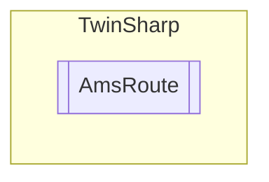

# AmsRoute `Public class`

## Diagram


## Members
### Properties
#### Public  properties
| Type | Name | Methods |
| --- | --- | --- |
| `string` | [`Adress`](#adress)<br>Address of tue TwinCAT target system<br>            The address depends on the transport protocol being used.In addition to TCP/IP addresses, addresses of Profibus devices are possible, which in turn must support the ADS protocol in order to be addressed as "target system" or "remote system". | `get` |
| `AmsNetId` | [`AmsNetId`](#amsnetid)<br>AmsNetId of the target system | `get` |
| `int` | [`Flags`](#flags) | `get` |
| `string` | [`Name`](#name)<br>Name of the possible target system logged on to the current TwinCAT router | `get` |
| `string` | [`Protocol`](#protocol)<br>Protocol used for communication with the target system. | `get` |

### Methods
#### Public  methods
| Returns | Name |
| --- | --- |
| `StateInfo` | [`GetStateInfo`](#getstateinfo)()<br>Gets the state information for this ams route. |
| `string` | [`ToString`](#tostring)() |

## Details
### Constructors
#### AmsRoute
[*Source code*](https://github.com///blob//TwinSharp/AmsRoute.cs#L7)
```csharp
internal AmsRoute(string name, string adress, AmsNetId amsNetId, string protocol, int flags)
```
##### Arguments
| Type | Name | Description |
| --- | --- | --- |
| `string` | name |   |
| `string` | adress |   |
| `AmsNetId` | amsNetId |   |
| `string` | protocol |   |
| `int` | flags |   |

### Methods
#### GetStateInfo
[*Source code*](https://github.com///blob//TwinSharp/AmsRoute.cs#L44)
```csharp
public StateInfo GetStateInfo()
```
##### Summary
Gets the state information for this ams route.

##### Returns


#### ToString
[*Source code*](https://github.com///blob//TwinSharp/AmsRoute.cs#L52)
```csharp
public override string ToString()
```

### Properties
#### Name
```csharp
public string Name { get; }
```
##### Summary
Name of the possible target system logged on to the current TwinCAT router

#### Adress
```csharp
public string Adress { get; }
```
##### Summary
Address of tue TwinCAT target system
            The address depends on the transport protocol being used.In addition to TCP/IP addresses, addresses of Profibus devices are possible, which in turn must support the ADS protocol in order to be addressed as "target system" or "remote system".

#### AmsNetId
```csharp
public AmsNetId AmsNetId { get; }
```
##### Summary
AmsNetId of the target system

#### Protocol
```csharp
public string Protocol { get; }
```
##### Summary
Protocol used for communication with the target system.

#### Flags
```csharp
public int Flags { get; }
```

*Generated with* [*ModularDoc*](https://github.com/hailstorm75/ModularDoc)
