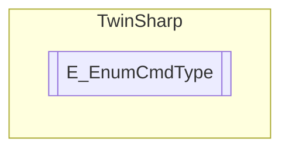

# E_EnumCmdType `Public enum`

## Diagram

```mermaid
  flowchart LR
  classDef interfaceStyle stroke-dasharray: 5 5;
  classDef abstractStyle stroke-width:4px
  subgraph TwinSharp
  TwinSharp.E_EnumCmdType[[E_EnumCmdType]]
  end
```

## Details
### Fields
#### First

#### Next

#### Abort

*Generated with* [*ModularDoc*](https://github.com/hailstorm75/ModularDoc)
