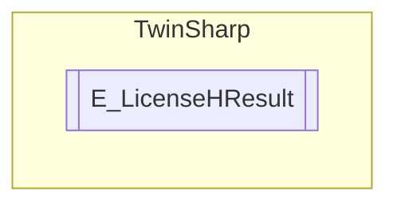

# E_LicenseHResult `Public enum`

## Diagram

## Details
### Fields
#### E_LHR_LicenseOK

#### E_LHR_LicenseOK_Pending

#### E_LHR_LicenseOK_Demo

#### E_LHR_LicenseOK_OEM

#### E_LHR_LicenseNoFound

#### E_LHR_LicenseExpired

#### E_LHR_LicenseExceeded

#### E_LHR_LicenseInvalid

#### E_LHR_LicenseSystemIdInvalid

#### E_LHR_LicenseNoTimeLimit

#### E_LHR_LicenseTimeInFuture

#### E_LHR_LicenseTimePeriodToLong

#### E_LHR_DeviceException

#### E_LHR_LicenseDuplicated

#### E_LHR_SignatureInvalid

#### E_LHR_CertificateInvalid

#### E_LHR_LicenseOemNotFound

#### E_LHR_LicenseRestricted

#### E_LHR_LicenseDemoDenied

#### E_LHR_LicensePlatformLevelInv

*Generated with* [*ModularDoc*](https://github.com/hailstorm75/ModularDoc)
