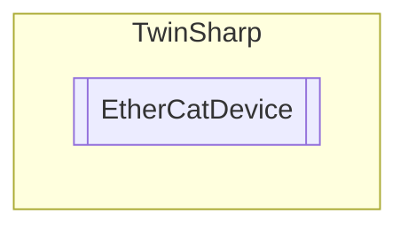

# EtherCatDevice `Public class`

## Description
Describes an EtherCAT device, using all standard objects as defined from the EtherCAT standard.
            This class can be derived and extended to create a specific EtherCAT device.

## Diagram


## Members
### Properties
#### Public  properties
| Type | Name | Methods |
| --- | --- | --- |
| `uint` | [`DeviceType`](#devicetype) | `get` |
| `byte` | [`ErrorRegister`](#errorregister) | `get` |
| `string` | [`ManufacturerDeviceName`](#manufacturerdevicename) | `get` |
| `string` | [`ManufacturerHardwareVersion`](#manufacturerhardwareversion) | `get` |
| `string` | [`ManufacturerSoftwareVersion`](#manufacturersoftwareversion) | `get` |
| `uint` | [`ProductCode`](#productcode) | `get` |
| `uint` | [`RevisionNumber`](#revisionnumber) | `get` |
| `uint` | [`SerialNumber`](#serialnumber) | `get` |
| `uint` | [`VendorID`](#vendorid) | `get` |

### Methods
#### Public  methods
| Returns | Name |
| --- | --- |
| `T` | [`CoeReadAny`](#coereadany)(`uint` index, `uint` subIndex) |
| `void` | [`CoeWriteAny`](#coewriteany)(`uint` index, `uint` subIndex, `object` value) |

## Details
### Summary
Describes an EtherCAT device, using all standard objects as defined from the EtherCAT standard.
            This class can be derived and extended to create a specific EtherCAT device.

### Constructors
#### EtherCatDevice
[*Source code*](https://github.com///blob//TwinSharp/EtherCatDevice.cs#L21)
```csharp
public EtherCatDevice(AdsClient client)
```
##### Arguments
| Type | Name | Description |
| --- | --- | --- |
| `AdsClient` | client |  |

##### Summary
Creates a representation of an EtherCAT device. 
            The client should typically be connected to the AmsNetId of the EtherCAT master and the port number is the slaves adress (example 1025).

### Methods
#### CoeWriteAny
[*Source code*](https://github.com///blob//TwinSharp/EtherCatDevice.cs#L71)
```csharp
public void CoeWriteAny(uint index, uint subIndex, object value)
```
##### Arguments
| Type | Name | Description |
| --- | --- | --- |
| `uint` | index |   |
| `uint` | subIndex |   |
| `object` | value |   |

#### CoeReadAny
[*Source code*](https://github.com///blob//TwinSharp/EtherCatDevice.cs#L76)
```csharp
public T CoeReadAny<T>(uint index, uint subIndex)
where T : 
```
##### Arguments
| Type | Name | Description |
| --- | --- | --- |
| `uint` | index |   |
| `uint` | subIndex |   |

### Properties
#### DeviceType
```csharp
public uint DeviceType { get; }
```

#### ErrorRegister
```csharp
public byte ErrorRegister { get; }
```

#### ManufacturerDeviceName
```csharp
public string ManufacturerDeviceName { get; }
```

#### ManufacturerHardwareVersion
```csharp
public string ManufacturerHardwareVersion { get; }
```

#### ManufacturerSoftwareVersion
```csharp
public string ManufacturerSoftwareVersion { get; }
```

#### VendorID
```csharp
public uint VendorID { get; }
```

#### ProductCode
```csharp
public uint ProductCode { get; }
```

#### RevisionNumber
```csharp
public uint RevisionNumber { get; }
```

#### SerialNumber
```csharp
public uint SerialNumber { get; }
```

*Generated with* [*ModularDoc*](https://github.com/hailstorm75/ModularDoc)
