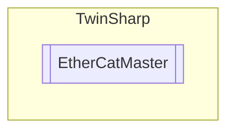

# EtherCatMaster `Public class`

## Diagram


## Members
### Properties
#### Public  properties
| Type | Name | Methods |
| --- | --- | --- |
| `ushort` | [`DeviceType`](#devicetype) | `get, internal set` |
| `ushort` | [`MasterDevState`](#masterdevstate)<br>Can be used to read the current state of the EtherCAT master. Corresponds to the PLC FB: FB_EcGetMasterDevState | `get` |
| `string` | [`Name`](#name) | `get, internal set` |
| `uint` | [`SlaveCount`](#slavecount)<br>Can be used to determine the number of slaves that are connected to the master. Corresponds to the PLC FB: FB_EcGetSlaveCount. | `get` |
| `ushort` | [`SlaveCountConfigured`](#slavecountconfigured) | `get` |

### Methods
#### Public  methods
| Returns | Name |
| --- | --- |
| `uint``[]` | [`GetAllSlaveAbnormalStateChanges`](#getallslaveabnormalstatechanges)()<br>Can be used to read the unexpected EtherCAT state changes of all the slaves connected to the master. It returns the number of unexpected state changes of all slaves as an array of UDINTs. <br>            EtherCAT state changes are unexpected if they were not requested by the EtherCAT master, e.g. if an EtherCAT slave spontaneously switches from OP state to SAFEOP state.<br>            Corresponds to the function block FB_EcGetAllSlaveAbnormalStateChanges. |
| [`ST_EcSlaveState`](./ST_EcSlaveState.md)`[]` | [`GetAllSlaveStates`](#getallslavestates)()<br>Reads the EtherCAT status and the Link status of all the slaves connected to the master.<br>            Corresponds to the function block FB_EcGetAllSlaveStates. |
| [`ST_EcSlaveConfigData`](./ST_EcSlaveConfigData.md)`[]` | [`GetConfiguredSlaves`](#getconfiguredslaves)()<br>Generates an array of all configured Slaves from the Master object directory.<br>            Corresponds to the function block FB_EcGetConfSlaves |
| [`ST_TopologyDataEx`](./ST_TopologyDataEx.md)`[]` | [`GetSlaveTopologyInfo`](#getslavetopologyinfo)() |
| `string` | [`MasterDevStateToString`](#masterdevstatetostring)(`ushort` masterDevState)<br>Converts the device status of the EtherCAT master to a string.<br>            For masterDevState == 0 'OK' is returned, otherwise, 'Not OK – Link error', e.g. for masterDevState == 1. If several errors are pending, they are separated by hyphens. |
| `string` | [`ToString`](#tostring)() |

## Details
### Constructors
#### EtherCatMaster
[*Source code*](https://github.com///blob//TwinSharp/EtherCatMaster.cs#L12)
```csharp
internal EtherCatMaster(AmsNetId netId)
```
##### Arguments
| Type | Name | Description |
| --- | --- | --- |
| `AmsNetId` | netId |   |

### Methods
#### MasterDevStateToString
[*Source code*](https://github.com///blob//TwinSharp/EtherCatMaster.cs#L53)
```csharp
public string MasterDevStateToString(ushort masterDevState)
```
##### Arguments
| Type | Name | Description |
| --- | --- | --- |
| `ushort` | masterDevState |  |

##### Summary
Converts the device status of the EtherCAT master to a string.
            For masterDevState == 0 'OK' is returned, otherwise, 'Not OK – Link error', e.g. for masterDevState == 1. If several errors are pending, they are separated by hyphens.

##### Returns


#### GetConfiguredSlaves
[*Source code*](https://github.com///blob//TwinSharp/EtherCatMaster.cs#L170)
```csharp
public ST_EcSlaveConfigData GetConfiguredSlaves()
```
##### Summary
Generates an array of all configured Slaves from the Master object directory.
            Corresponds to the function block FB_EcGetConfSlaves

##### Returns


#### GetAllSlaveAbnormalStateChanges
[*Source code*](https://github.com///blob//TwinSharp/EtherCatMaster.cs#L203)
```csharp
public uint GetAllSlaveAbnormalStateChanges()
```
##### Summary
Can be used to read the unexpected EtherCAT state changes of all the slaves connected to the master. It returns the number of unexpected state changes of all slaves as an array of UDINTs. 
            EtherCAT state changes are unexpected if they were not requested by the EtherCAT master, e.g. if an EtherCAT slave spontaneously switches from OP state to SAFEOP state.
            Corresponds to the function block FB_EcGetAllSlaveAbnormalStateChanges.

#### GetAllSlaveStates
[*Source code*](https://github.com///blob//TwinSharp/EtherCatMaster.cs#L229)
```csharp
public ST_EcSlaveState GetAllSlaveStates()
```
##### Summary
Reads the EtherCAT status and the Link status of all the slaves connected to the master.
            Corresponds to the function block FB_EcGetAllSlaveStates.

#### GetSlaveTopologyInfo
[*Source code*](https://github.com///blob//TwinSharp/EtherCatMaster.cs#L254)
```csharp
public ST_TopologyDataEx GetSlaveTopologyInfo()
```

#### ToString
[*Source code*](https://github.com///blob//TwinSharp/EtherCatMaster.cs#L279)
```csharp
public override string ToString()
```

### Properties
#### DeviceType
```csharp
public ushort DeviceType { get; internal set; }
```

#### Name
```csharp
public string Name { get; internal set; }
```

#### MasterDevState
```csharp
public ushort MasterDevState { get; }
```
##### Summary
Can be used to read the current state of the EtherCAT master. Corresponds to the PLC FB: FB_EcGetMasterDevState

#### SlaveCount
```csharp
public uint SlaveCount { get; }
```
##### Summary
Can be used to determine the number of slaves that are connected to the master. Corresponds to the PLC FB: FB_EcGetSlaveCount.

#### SlaveCountConfigured
```csharp
public ushort SlaveCountConfigured { get; }
```

*Generated with* [*ModularDoc*](https://github.com/hailstorm75/ModularDoc)
