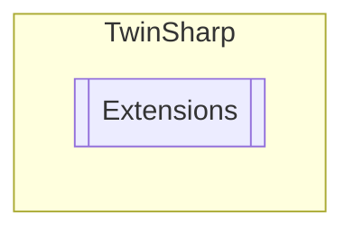

# Extensions `Public class`

## Diagram


## Members
### Methods
#### Public Static methods
| Returns | Name |
| --- | --- |
| `DateTime` | [`ReadDateTime`](#readdatetime)(`AdsClient` client, `uint` handle) |
| `string` | [`ReadString`](#readstring)(`AdsClient` client, `uint` indexGroup, `uint` indexOffset, `int` len) |
| `uint` | [`ToUint`](#touint)(`byte``[]` buffer) |

## Details
### Methods
#### ReadString
[*Source code*](https://github.com///blob//TwinSharp/Extensions.cs#L9)
```csharp
public static string ReadString(AdsClient client, uint indexGroup, uint indexOffset, int len)
```
##### Arguments
| Type | Name | Description |
| --- | --- | --- |
| `AdsClient` | client |   |
| `uint` | indexGroup |   |
| `uint` | indexOffset |   |
| `int` | len |   |

#### ReadDateTime
[*Source code*](https://github.com///blob//TwinSharp/Extensions.cs#L14)
```csharp
public static DateTime ReadDateTime(AdsClient client, uint handle)
```
##### Arguments
| Type | Name | Description |
| --- | --- | --- |
| `AdsClient` | client |   |
| `uint` | handle |   |

#### ToUint
[*Source code*](https://github.com///blob//TwinSharp/Extensions.cs#L23)
```csharp
public static uint ToUint(byte[] buffer)
```
##### Arguments
| Type | Name | Description |
| --- | --- | --- |
| `byte``[]` | buffer |   |

*Generated with* [*ModularDoc*](https://github.com/hailstorm75/ModularDoc)
