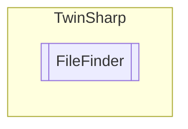

# FileFinder `Public class`

## Diagram


## Members
### Properties
#### Public  properties
| Type | Name | Methods |
| --- | --- | --- |
| `bool` | [`EndOfEnumeration`](#endofenumeration)<br>End of enumeration was reached. During the first attempt to read a non-existing entry this output is set to TRUE. | `get` |

### Methods
#### Public  methods
| Returns | Name |
| --- | --- |
| `void` | [`Abort`](#abort)()<br>Call this when you dont want to continue enumeration of files. Releases resources on TwinCAT side. |
| `Nullable`&lt;[`ST_FindFileEntry`](./ST_FindFileEntry.md)&gt; | [`GetNextFileOrNull`](#getnextfileornull)() |

## Details
### Constructors
#### FileFinder
[*Source code*](https://github.com///blob//TwinSharp/FileSystem.cs#L414)
```csharp
internal FileFinder(AdsClient client, string searchQuery)
```
##### Arguments
| Type | Name | Description |
| --- | --- | --- |
| `AdsClient` | client |   |
| `string` | searchQuery |   |

### Methods
#### Abort
[*Source code*](https://github.com///blob//TwinSharp/FileSystem.cs#L430)
```csharp
public void Abort()
```
##### Summary
Call this when you dont want to continue enumeration of files. Releases resources on TwinCAT side.

#### GetNextFileOrNull
[*Source code*](https://github.com///blob//TwinSharp/FileSystem.cs#L440)
```csharp
public Nullable<ST_FindFileEntry> GetNextFileOrNull()
```

### Properties
#### EndOfEnumeration
```csharp
public bool EndOfEnumeration { get; }
```
##### Summary
End of enumeration was reached. During the first attempt to read a non-existing entry this output is set to TRUE.

*Generated with* [*ModularDoc*](https://github.com/hailstorm75/ModularDoc)
