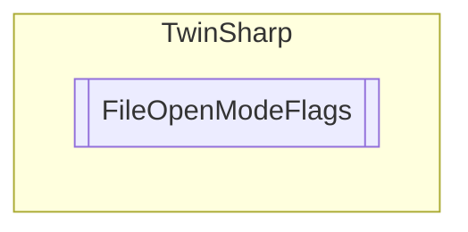

# FileOpenModeFlags `Public enum`

## Diagram

## Details
### Fields
#### FOPEN_MODEREAD

#### FOPEN_MODEWRITE

#### FOPEN_MODEAPPEND

#### FOPEN_MODEPLUS

#### FOPEN_MODEBINARY

#### FOPEN_MODETEXT

*Generated with* [*ModularDoc*](https://github.com/hailstorm75/ModularDoc)
