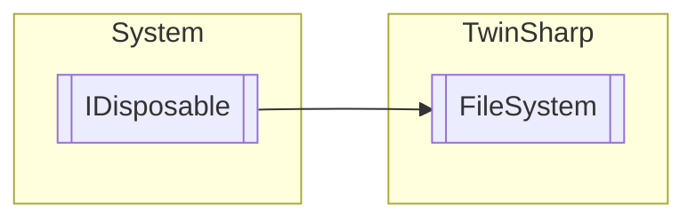

# FileSystem `Public class`

## Description
The FileSystem class provides methods for interacting with the file system on a target device using the TwinCAT ADS protocol.
            It allows opening, closing, reading, writing, seeking, deleting files, as well as creating and deleting directories.

## Diagram


## Members
### Methods
#### Public  methods
| Returns | Name |
| --- | --- |
| `void` | [`CreateDirectory`](#createdirectory)(`string` path)<br>Create a new folder on the target. Note: does not create folders recursively. |
| [`FileFinder`](./FileFinder.md) | [`CreateFileFinder`](#createfilefinder)(`string` searchQuery)<br>Use a file finder to search for files on target device. |
| `void` | [`DeleteDirectory`](#deletedirectory)(`string` path)<br>Can be used to delete a directory from the data storage device.<br>            A directory containing files cannot be deleted.<br>            Equivavalent to the function block FB_RemoveDir. |
| `void` | [`Dispose`](#dispose)() |
| `void` | [`FileClose`](#fileclose)(`ushort` handle)<br>The function block FB_FileClose closes the file, thereby putting it in a defined state for further processing by other programs.<br>            Equivavelent to the TwinCAT function block FB_FileClose. |
| `void` | [`FileDelete`](#filedelete)(`string` pathName)<br>Deletes a file from the data storage device.<br>            Equivavalent to the function block FB_FileDelete. |
| `string` | [`FileGetString`](#filegetstring)(`ushort` handle, out `bool` endOfFile) |
| `ushort` | [`FileOpen`](#fileopen)(`string` path, [`FileOpenModeFlags`](./FileOpenModeFlags.md) mode)<br>Creates a new file or opens an existing file for editing.<br>            Equivavelent to the TwinCAT function block FB_FileOpen |
| `void` | [`FilePutString`](#fileputstring)(`ushort` fileHandle, `string` str)<br>Writes strings into a file. The string is written to the file up to the null termination, but without the null character. The file must have been opened in text mode.<br>            Equivalent to the function block FB_FilePuts |
| `byte``[]` | [`FileRead`](#fileread)(`ushort` handle, `int` byteCountToRead)<br>The contents of an already opened file can be read. Before a read access, the file must have been opened in the corresponding mode. In addition to the FOPEN_MODEREAD, the appropriate format (FOPEN_MODEBINARY or FOPEN_MODETEXT) is also important to achieve the desired result.<br>            Equivavalent to the function block FB_FileRead. |
| `void` | [`FileRename`](#filerename)(`string` oldPath, `string` newPath)<br>Can be used to rename a file.<br>            Equivavalent to the function block FB_FileRename. |
| `void` | [`FileSeek`](#fileseek)(`ushort` handle, `int` position, `SeekOrigin` origin)<br>Sets the file pointer of an open file to a definable position.<br>            Equivavalent to the function block FB_FileSeek. |
| `int` | [`FileTell`](#filetell)(`uint` handle)<br>Determines the current position of the file pointer. The position indicates the relative offset from the start of the file. <br>            Equivavalent to the function block FB_FileTell.<br>            Note that for files opened in "Append at end of file" mode, the current position is determined by the last I/O operation, not by the position of the next write access.<br>            After a read operation, for example, the file pointer is at the position where the next read access will take place, not at the position where the next write access will take place. In append mode, the file pointer is always moved to the end before the write operation.<br>            If no previous I/O operation was performed and the file was opened in append mode, the file pointer is at the start of the file. |
| `uint` | [`FileWrite`](#filewrite)(`ushort` handle, `byte``[]` data)<br>Writes data into a file. For write access the file must have been opened in the corresponding mode, and it must be closed again for further processing by external programs.<br>            Equivalent to the function block FB_FileWrite. |
| [`ST_FindFileEntry`](./ST_FindFileEntry.md) | [`GetFileProperties`](#getfileproperties)(`string` path) |

#### Internal Static methods
| Returns | Name |
| --- | --- |
| [`ST_FindFileEntry`](./ST_FindFileEntry.md) | [`CreateFileEntry`](#createfileentry)(`byte``[]` buffer) |

## Details
### Summary
The FileSystem class provides methods for interacting with the file system on a target device using the TwinCAT ADS protocol.
            It allows opening, closing, reading, writing, seeking, deleting files, as well as creating and deleting directories.

### Inheritance
 - `IDisposable`

### Constructors
#### FileSystem
[*Source code*](https://github.com///blob//TwinSharp/FileSystem.cs#L14)
```csharp
internal FileSystem(AmsNetId target)
```
##### Arguments
| Type | Name | Description |
| --- | --- | --- |
| `AmsNetId` | target |   |

### Methods
#### FileOpen
[*Source code*](https://github.com///blob//TwinSharp/FileSystem.cs#L27)
```csharp
public ushort FileOpen(string path, FileOpenModeFlags mode)
```
##### Arguments
| Type | Name | Description |
| --- | --- | --- |
| `string` | path |  |
| [`FileOpenModeFlags`](./FileOpenModeFlags.md) | mode |  |

##### Summary
Creates a new file or opens an existing file for editing.
            Equivavelent to the TwinCAT function block FB_FileOpen

#### FileClose
[*Source code*](https://github.com///blob//TwinSharp/FileSystem.cs#L48)
```csharp
public void FileClose(ushort handle)
```
##### Arguments
| Type | Name | Description |
| --- | --- | --- |
| `ushort` | handle |  |

##### Summary
The function block FB_FileClose closes the file, thereby putting it in a defined state for further processing by other programs.
            Equivavelent to the TwinCAT function block FB_FileClose.

#### FileGetString
[*Source code*](https://github.com///blob//TwinSharp/FileSystem.cs#L68)
```csharp
public string FileGetString(ushort handle, out bool endOfFile)
```
##### Arguments
| Type | Name | Description |
| --- | --- | --- |
| `ushort` | handle |   |
| `out` `bool` | endOfFile |   |

#### FilePutString
[*Source code*](https://github.com///blob//TwinSharp/FileSystem.cs#L100)
```csharp
public void FilePutString(ushort fileHandle, string str)
```
##### Arguments
| Type | Name | Description |
| --- | --- | --- |
| `ushort` | fileHandle |  |
| `string` | str |  |

##### Summary
Writes strings into a file. The string is written to the file up to the null termination, but without the null character. The file must have been opened in text mode.
            Equivalent to the function block FB_FilePuts

#### FileRead
[*Source code*](https://github.com///blob//TwinSharp/FileSystem.cs#L120)
```csharp
public byte FileRead(ushort handle, int byteCountToRead)
```
##### Arguments
| Type | Name | Description |
| --- | --- | --- |
| `ushort` | handle |  |
| `int` | byteCountToRead | Number of bytes to be read. |

##### Summary
The contents of an already opened file can be read. Before a read access, the file must have been opened in the corresponding mode. In addition to the FOPEN_MODEREAD, the appropriate format (FOPEN_MODEBINARY or FOPEN_MODETEXT) is also important to achieve the desired result.
            Equivavalent to the function block FB_FileRead.

##### Returns


#### FileWrite
[*Source code*](https://github.com///blob//TwinSharp/FileSystem.cs#L150)
```csharp
public uint FileWrite(ushort handle, byte[] data)
```
##### Arguments
| Type | Name | Description |
| --- | --- | --- |
| `ushort` | handle |  |
| `byte``[]` | data |  |

##### Summary
Writes data into a file. For write access the file must have been opened in the corresponding mode, and it must be closed again for further processing by external programs.
            Equivalent to the function block FB_FileWrite.

##### Returns
The number of bytes that were sucessfully written.

#### FileSeek
[*Source code*](https://github.com///blob//TwinSharp/FileSystem.cs#L172)
```csharp
public void FileSeek(ushort handle, int position, SeekOrigin origin)
```
##### Arguments
| Type | Name | Description |
| --- | --- | --- |
| `ushort` | handle |  |
| `int` | position |  |
| `SeekOrigin` | origin |  |

##### Summary
Sets the file pointer of an open file to a definable position.
            Equivavalent to the function block FB_FileSeek.

#### FileTell
[*Source code*](https://github.com///blob//TwinSharp/FileSystem.cs#L199)
```csharp
public int FileTell(uint handle)
```
##### Arguments
| Type | Name | Description |
| --- | --- | --- |
| `uint` | handle |  |

##### Summary
Determines the current position of the file pointer. The position indicates the relative offset from the start of the file. 
            Equivavalent to the function block FB_FileTell.
            Note that for files opened in "Append at end of file" mode, the current position is determined by the last I/O operation, not by the position of the next write access.
            After a read operation, for example, the file pointer is at the position where the next read access will take place, not at the position where the next write access will take place. In append mode, the file pointer is always moved to the end before the write operation.
            If no previous I/O operation was performed and the file was opened in append mode, the file pointer is at the start of the file.

##### Returns
The current position of the file pointer.

#### FileDelete
[*Source code*](https://github.com///blob//TwinSharp/FileSystem.cs#L219)
```csharp
public void FileDelete(string pathName)
```
##### Arguments
| Type | Name | Description |
| --- | --- | --- |
| `string` | pathName | File name, including the full path. |

##### Summary
Deletes a file from the data storage device.
            Equivavalent to the function block FB_FileDelete.

#### FileRename
[*Source code*](https://github.com///blob//TwinSharp/FileSystem.cs#L237)
```csharp
public void FileRename(string oldPath, string newPath)
```
##### Arguments
| Type | Name | Description |
| --- | --- | --- |
| `string` | oldPath |  |
| `string` | newPath |  |

##### Summary
Can be used to rename a file.
            Equivavalent to the function block FB_FileRename.

#### CreateDirectory
[*Source code*](https://github.com///blob//TwinSharp/FileSystem.cs#L253)
```csharp
public void CreateDirectory(string path)
```
##### Arguments
| Type | Name | Description |
| --- | --- | --- |
| `string` | path |  |

##### Summary
Create a new folder on the target. Note: does not create folders recursively.

#### DeleteDirectory
[*Source code*](https://github.com///blob//TwinSharp/FileSystem.cs#L272)
```csharp
public void DeleteDirectory(string path)
```
##### Arguments
| Type | Name | Description |
| --- | --- | --- |
| `string` | path |  |

##### Summary
Can be used to delete a directory from the data storage device.
            A directory containing files cannot be deleted.
            Equivavalent to the function block FB_RemoveDir.

#### GetFileProperties
[*Source code*](https://github.com///blob//TwinSharp/FileSystem.cs#L289)
```csharp
public ST_FindFileEntry GetFileProperties(string path)
```
##### Arguments
| Type | Name | Description |
| --- | --- | --- |
| `string` | path |  |

##### Summary


##### Returns


#### CreateFileEntry
[*Source code*](https://github.com///blob//TwinSharp/FileSystem.cs#L311)
```csharp
internal static ST_FindFileEntry CreateFileEntry(byte[] buffer)
```
##### Arguments
| Type | Name | Description |
| --- | --- | --- |
| `byte``[]` | buffer |   |

#### CreateFileFinder
[*Source code*](https://github.com///blob//TwinSharp/FileSystem.cs#L381)
```csharp
public FileFinder CreateFileFinder(string searchQuery)
```
##### Arguments
| Type | Name | Description |
| --- | --- | --- |
| `string` | searchQuery | A valid directory name or directory with file name as string. The string can contain (* and ? ) as wildcards. If the path ends with a wildcard, dot or the directory name, the user must have access rights to this path and its subdirectories. |

##### Summary
Use a file finder to search for files on target device.

##### Returns


#### Dispose
[*Source code*](https://github.com///blob//TwinSharp/FileSystem.cs#L403)
```csharp
public virtual void Dispose()
```

*Generated with* [*ModularDoc*](https://github.com/hailstorm75/ModularDoc)
