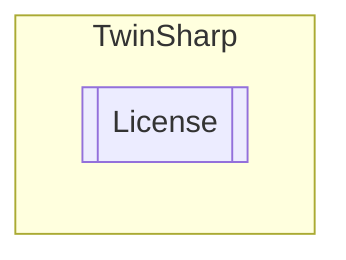

# License `Public class`

## Description
Represents a license manager for a TwinCAT system.

## Diagram


## Members
### Methods
#### Public  methods
| Returns | Name |
| --- | --- |
| [`ST_CheckLicense`](./ST_CheckLicense.md)`[]` | [`GetValidLicenses`](#getvalidlicenses)()<br>Gets the valid licenses for the target. |

## Details
### Summary
Represents a license manager for a TwinCAT system.

### Constructors
#### License
[*Source code*](https://github.com///blob//TwinSharp/License.cs#L17)
```csharp
internal License(AmsNetId target)
```
##### Arguments
| Type | Name | Description |
| --- | --- | --- |
| `AmsNetId` | target | The target AmsNetId. |

##### Summary
Initializes a new instance of the [License](twinsharp/License.md) class.

### Methods
#### GetValidLicenses
[*Source code*](https://github.com///blob//TwinSharp/License.cs#L27)
```csharp
public ST_CheckLicense GetValidLicenses()
```
##### Summary
Gets the valid licenses for the target.

##### Returns
An array of valid licenses.

*Generated with* [*ModularDoc*](https://github.com/hailstorm75/ModularDoc)
