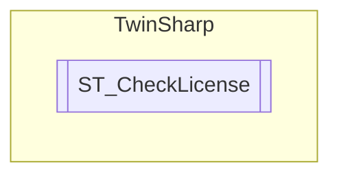

# ST_CheckLicense `Public class`

## Description
Structure with license information.

## Diagram


## Members
### Methods
#### Public  methods
| Returns | Name |
| --- | --- |
| `string` | [`ToString`](#tostring)()<br>Returns a string representation of the license. |

## Details
### Summary
Structure with license information.

### Constructors
#### ST_CheckLicense
[*Source code*](https://github.com///blob//TwinSharp/Structs.cs#L65)
```csharp
public ST_CheckLicense(byte[] bytes, string descriptionText)
```
##### Arguments
| Type | Name | Description |
| --- | --- | --- |
| `byte``[]` | bytes |  |
| `string` | descriptionText |  |

##### Summary
Constructor for ST_CheckLicense from a byte array of length 48.

##### Exceptions
| Name | Description |
| --- | --- |
| Exception |  |

### Methods
#### ToString
[*Source code*](https://github.com///blob//TwinSharp/Structs.cs#L96)
```csharp
public override string ToString()
```
##### Summary
Returns a string representation of the license.

##### Returns


*Generated with* [*ModularDoc*](https://github.com/hailstorm75/ModularDoc)
