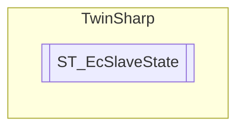

# ST_EcSlaveState `Public class`

## Description
The structure ST_EcSlaveState contains the EtherCAT state and the link state of an EtherCAT slave device.

## Diagram


## Details
### Summary
The structure ST_EcSlaveState contains the EtherCAT state and the link state of an EtherCAT slave device.

### Constructors
#### ST_EcSlaveState
[*Source code*](https://github.com///blob//TwinSharp/Structs.cs#L121)
```csharp
public ST_EcSlaveState(byte[] bytes)
```
##### Arguments
| Type | Name | Description |
| --- | --- | --- |
| `byte``[]` | bytes |  |

##### Summary
Constructor for ST_EcSlaveState from a byte array of length 2.

##### Exceptions
| Name | Description |
| --- | --- |
| Exception |  |

*Generated with* [*ModularDoc*](https://github.com/hailstorm75/ModularDoc)
