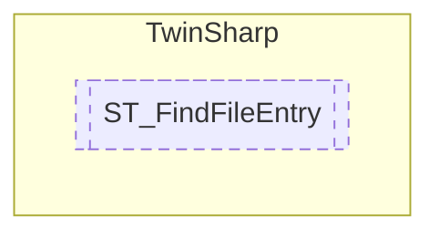

# ST_FindFileEntry `Public struct`

## Description
The structure ST_FindFileEntry contains information about a file or directory found by the FindFirstFile and FindNextFile functions.

## Diagram

## Details
### Summary
The structure ST_FindFileEntry contains information about a file or directory found by the FindFirstFile and FindNextFile functions.

*Generated with* [*ModularDoc*](https://github.com/hailstorm75/ModularDoc)
