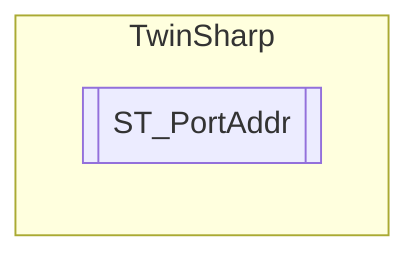

# ST_PortAddr `Public class`

## Description
The structure ST_PortAddr contains EtherCAT topology information for EtherCAT slave device. EtherCAT slave devices typically have 2 to 4 ports.

## Diagram


## Details
### Summary
The structure ST_PortAddr contains EtherCAT topology information for EtherCAT slave device. EtherCAT slave devices typically have 2 to 4 ports.

### Constructors
#### ST_PortAddr
[*Source code*](https://github.com///blob//TwinSharp/Structs.cs#L382)
```csharp
public ST_PortAddr(byte[] bytes)
```
##### Arguments
| Type | Name | Description |
| --- | --- | --- |
| `byte``[]` | bytes |  |

##### Summary
Constructor for ST_PortAddr

##### Exceptions
| Name | Description |
| --- | --- |
| Exception |  |

*Generated with* [*ModularDoc*](https://github.com/hailstorm75/ModularDoc)
