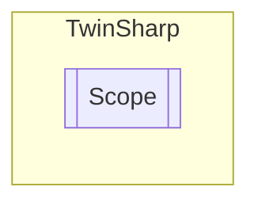

# Scope `Public class`

## Diagram


## Members
### Properties
#### Public  properties
| Type | Name | Methods |
| --- | --- | --- |
| `bool` | [`OnlineMode`](#onlinemode) | `get, set` |

### Methods
#### Public  methods
| Returns | Name |
| --- | --- |
| `void` | [`LoadConfigurationFile`](#loadconfigurationfile)(`string` filename)<br>Load *.scp File (Scope Configuration Project) |
| `void` | [`ManualTrigger`](#manualtrigger)()<br>Issuing this command triggers the Scope. It must, however, be online. |

## Details
### Constructors
#### Scope
[*Source code*](https://github.com///blob//TwinSharp/Scope.cs#L14)
```csharp
public Scope(AmsNetId amsNetId)
```
##### Arguments
| Type | Name | Description |
| --- | --- | --- |
| `AmsNetId` | amsNetId |   |

### Methods
#### LoadConfigurationFile
[*Source code*](https://github.com///blob//TwinSharp/Scope.cs#L42)
```csharp
public void LoadConfigurationFile(string filename)
```
##### Arguments
| Type | Name | Description |
| --- | --- | --- |
| `string` | filename | E.g. D:\\TwinCAT\\scope\\achse2.scp |

##### Summary
Load *.scp File (Scope Configuration Project)

#### ManualTrigger
[*Source code*](https://github.com///blob//TwinSharp/Scope.cs#L50)
```csharp
public void ManualTrigger()
```
##### Summary
Issuing this command triggers the Scope. It must, however, be online.

### Properties
#### OnlineMode
```csharp
public bool OnlineMode { get; set; }
```

*Generated with* [*ModularDoc*](https://github.com/hailstorm75/ModularDoc)
