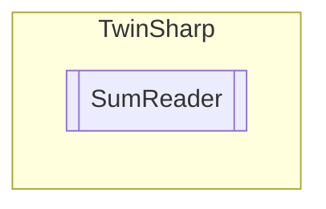

# SumReader `Public class`

## Description
Using the ADS Sum Command it is possible to read or write several variables in one command.

## Diagram


## Members
### Methods
#### Public  methods
| Returns | Name |
| --- | --- |
| `void` | [`AddVariable`](#addvariable-12)(`...`) |
| `bool` | [`ReadVariables`](#readvariables)(out `byte``[]` returnedValues) |

## Details
### Summary
Using the ADS Sum Command it is possible to read or write several variables in one command.

### Constructors
#### SumReader
[*Source code*](https://github.com///blob//TwinSharp/SumReader.cs#L23)
```csharp
public SumReader(AdsClient client)
```
##### Arguments
| Type | Name | Description |
| --- | --- | --- |
| `AdsClient` | client |   |

### Methods
#### AddVariable [1/2]
[*Source code*](https://github.com///blob//TwinSharp/SumReader.cs#L35)
```csharp
public void AddVariable(string symbolName, Type type)
```
##### Arguments
| Type | Name | Description |
| --- | --- | --- |
| `string` | symbolName |   |
| `Type` | type |   |

#### AddVariable [2/2]
[*Source code*](https://github.com///blob//TwinSharp/SumReader.cs#L42)
```csharp
public void AddVariable(uint indexGroup, uint indexOffset, Type type)
```
##### Arguments
| Type | Name | Description |
| --- | --- | --- |
| `uint` | indexGroup |   |
| `uint` | indexOffset |   |
| `Type` | type |   |

#### ReadVariables
[*Source code*](https://github.com///blob//TwinSharp/SumReader.cs#L87)
```csharp
public bool ReadVariables(out byte[] returnedValues)
```
##### Arguments
| Type | Name | Description |
| --- | --- | --- |
| `out` `byte``[]` | returnedValues |   |

*Generated with* [*ModularDoc*](https://github.com/hailstorm75/ModularDoc)
