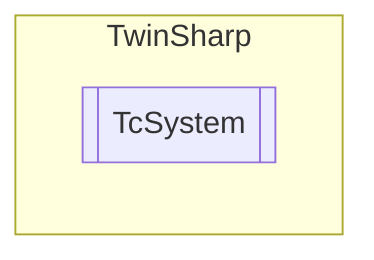

# TcSystem `Public class`

## Description
The TcSystem class represents a TwinCAT system and provides methods to interact with it.
            It allows switching the system to different modes (Config, Restart, Stop), listing EtherCAT masters,
            and listing local static routes. It also provides access to the system's real-time properties, license information,
            and file system through the Realtime, License, and FileSystem properties respectively.

## Diagram


## Members
### Properties
#### Public  properties
| Type | Name | Methods |
| --- | --- | --- |
| [`FileSystem`](./FileSystem.md) | [`FileSystem`](#filesystem)<br>Gets the FileSystem object which provides access to the TwinCAT system's file system. Can be used to read and delete files on the remote system. | `get, private set` |
| [`License`](./License.md) | [`License`](#license)<br>Gets the License object which provides access to the TwinCAT system's license information. | `get, private set` |
| [`Realtime`](./Realtime.md) | [`Realtime`](#realtime)<br>Gets the Realtime object which provides access to the TwinCAT system's real-time properties. | `get, private set` |

### Methods
#### Public  methods
| Returns | Name |
| --- | --- |
| [`EtherCatMaster`](./EtherCatMaster.md)`[]` | [`ListEtherCatMasters`](#listethercatmasters)()<br>Lists all the existing EtherCAT masters on the TwinCAT system. |
| `void` | [`Restart`](#restart)()<br>Can be used to restart the TwinCAT system. <br>            Corresponds to the Restart command on the TwinCAT system menu (on the right of the Windows taskbar). Restarting the TwinCAT system involves the TwinCAT system first being stopped, and then immediately started again |
| `void` | [`Stop`](#stop)()<br>Can be used to stop the TwinCAT system. The function corresponds to the Stop command on the TwinCAT system menu (on the right of the Windows taskbar). |
| `void` | [`SwitchToConfigMode`](#switchtoconfigmode)()<br>A TwinCAT system in RUN mode (green TwinCAT system icon) can be switched to CONFIG mode (blue TwinCAT system icon) via the function block "TC_Config".<br>            If the system is already in CONFIG mode, it is first switched to STOP mode (red TwinCAT system icon) and then to CONFIG mode. |

#### Public Static methods
| Returns | Name |
| --- | --- |
| [`AmsRoute`](./AmsRoute.md)`[]` | [`ListLocalStaticRoutes`](#listlocalstaticroutes)()<br>List all the existing static routes on the local TwinCAT system. |

## Details
### Summary
The TcSystem class represents a TwinCAT system and provides methods to interact with it.
            It allows switching the system to different modes (Config, Restart, Stop), listing EtherCAT masters,
            and listing local static routes. It also provides access to the system's real-time properties, license information,
            and file system through the Realtime, License, and FileSystem properties respectively.

### Constructors
#### TcSystem
[*Source code*](https://github.com///blob//TwinSharp/TcSystem.cs#L24)
```csharp
public TcSystem(AmsNetId target)
```
##### Arguments
| Type | Name | Description |
| --- | --- | --- |
| `AmsNetId` | target | Use AmsNetId.Local for a local system. |

##### Summary
Creates a representation of a TwinCAT system.

### Methods
#### SwitchToConfigMode
[*Source code*](https://github.com///blob//TwinSharp/TcSystem.cs#L59)
```csharp
public void SwitchToConfigMode()
```
##### Summary
A TwinCAT system in RUN mode (green TwinCAT system icon) can be switched to CONFIG mode (blue TwinCAT system icon) via the function block "TC_Config".
            If the system is already in CONFIG mode, it is first switched to STOP mode (red TwinCAT system icon) and then to CONFIG mode.

#### Restart
[*Source code*](https://github.com///blob//TwinSharp/TcSystem.cs#L72)
```csharp
public void Restart()
```
##### Summary
Can be used to restart the TwinCAT system. 
            Corresponds to the Restart command on the TwinCAT system menu (on the right of the Windows taskbar). Restarting the TwinCAT system involves the TwinCAT system first being stopped, and then immediately started again

#### Stop
[*Source code*](https://github.com///blob//TwinSharp/TcSystem.cs#L84)
```csharp
public void Stop()
```
##### Summary
Can be used to stop the TwinCAT system. The function corresponds to the Stop command on the TwinCAT system menu (on the right of the Windows taskbar).

#### ListEtherCatMasters
[*Source code*](https://github.com///blob//TwinSharp/TcSystem.cs#L97)
```csharp
public EtherCatMaster ListEtherCatMasters()
```
##### Summary
Lists all the existing EtherCAT masters on the TwinCAT system.

##### Returns


#### ListLocalStaticRoutes
[*Source code*](https://github.com///blob//TwinSharp/TcSystem.cs#L182)
```csharp
public static AmsRoute ListLocalStaticRoutes()
```
##### Summary
List all the existing static routes on the local TwinCAT system.

##### Returns


##### Exceptions
| Name | Description |
| --- | --- |
| FileNotFoundException |  |

### Properties
#### Realtime
```csharp
public Realtime Realtime { get; private set; }
```
##### Summary
Gets the Realtime object which provides access to the TwinCAT system's real-time properties.

#### License
```csharp
public License License { get; private set; }
```
##### Summary
Gets the License object which provides access to the TwinCAT system's license information.

#### FileSystem
```csharp
public FileSystem FileSystem { get; private set; }
```
##### Summary
Gets the FileSystem object which provides access to the TwinCAT system's file system. Can be used to read and delete files on the remote system.

*Generated with* [*ModularDoc*](https://github.com/hailstorm75/ModularDoc)
