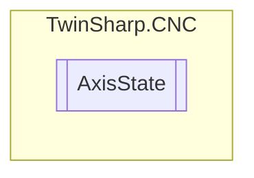

# AxisState `Public enum`

## Diagram

## Details
### Fields
#### HLI_AXIS_READY

#### HLI_AXIS_ACTIVE

#### HLI_AXIS_HOLD

#### HLI_AXIS_ERROR

*Generated with* [*ModularDoc*](https://github.com/hailstorm75/ModularDoc)
