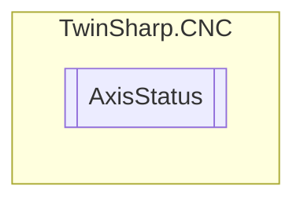

# AxisStatus `Public class`

## Description
Axis status as taken from HLI. https://infosys.beckhoff.com/content/1033/tf5200_hli_interface/174749195.html?id=8719845080216701702

## Diagram


## Members
### Properties
#### Public  properties
| Type | Name | Methods |
| --- | --- | --- |
| `double` | [`ActiveFeedrate`](#activefeedrate) | `get` |
| `int` | [`ActualPositionACS`](#actualpositionacs)<br>Actual position of the current cycle in the axis coordinate system | `get` |
| `string` | [`AxisName`](#axisname) | `get` |
| `ushort` | [`ChannelNumber`](#channelnumber)<br>Return the number of the channel to which the axis is assigned, or 0 if unassigned. | `get` |
| `int` | [`CommandedPositionACS`](#commandedpositionacs)<br>Command position of current cycle in the axis coordinate system. | `get` |
| `double` | [`CurrentFeedrate`](#currentfeedrate) | `get` |
| `sbyte` | [`Direction`](#direction) | `get` |
| `int` | [`EndPositionACS`](#endpositionacs)<br>Target position in the current NC block, ACS. This represents the target position of the program coordinate system referred to the axes. It is valid only as long as no transformation is active. Currently, the target position is not transformed back onto the axes. | `get` |
| `bool` | [`HomingDone`](#homingdone) | `get` |
| `bool` | [`InPosition`](#inposition) | `get` |
| `uint` | [`Mode`](#mode) | `get` |
| [`AxisState`](./AxisState.md) | [`State`](#state)<br>Even if an axis is not moved in the PCS, a corresponding Cartesian or kinematic transformation may nevertheless execute a motion of the physical axis.<br>            Example: 90° rotation about Z; Y is moved if X is programmed. | `get` |
| `ushort` | [`Type`](#type) | `get` |

## Details
### Summary
Axis status as taken from HLI. https://infosys.beckhoff.com/content/1033/tf5200_hli_interface/174749195.html?id=8719845080216701702

### Constructors
#### AxisStatus
[*Source code*](https://github.com///blob//TwinSharp/CNC/AxisStatus.cs#L16)
```csharp
internal AxisStatus(uint index, AdsClient comClient)
```
##### Arguments
| Type | Name | Description |
| --- | --- | --- |
| `uint` | index |   |
| `AdsClient` | comClient |   |

### Properties
#### Type
```csharp
public ushort Type { get; }
```

#### CommandedPositionACS
```csharp
public int CommandedPositionACS { get; }
```
##### Summary
Command position of current cycle in the axis coordinate system.

#### ActualPositionACS
```csharp
public int ActualPositionACS { get; }
```
##### Summary
Actual position of the current cycle in the axis coordinate system

#### EndPositionACS
```csharp
public int EndPositionACS { get; }
```
##### Summary
Target position in the current NC block, ACS. This represents the target position of the program coordinate system referred to the axes. It is valid only as long as no transformation is active. Currently, the target position is not transformed back onto the axes.

#### ActiveFeedrate
```csharp
public double ActiveFeedrate { get; }
```

#### CurrentFeedrate
```csharp
public double CurrentFeedrate { get; }
```

#### Direction
```csharp
public sbyte Direction { get; }
```

#### Mode
```csharp
public uint Mode { get; }
```

#### AxisName
```csharp
public string AxisName { get; }
```

#### InPosition
```csharp
public bool InPosition { get; }
```

#### HomingDone
```csharp
public bool HomingDone { get; }
```

#### State
```csharp
public AxisState State { get; }
```
##### Summary
Even if an axis is not moved in the PCS, a corresponding Cartesian or kinematic transformation may nevertheless execute a motion of the physical axis.
            Example: 90° rotation about Z; Y is moved if X is programmed.

#### ChannelNumber
```csharp
public ushort ChannelNumber { get; }
```
##### Summary
Return the number of the channel to which the axis is assigned, or 0 if unassigned.

*Generated with* [*ModularDoc*](https://github.com/hailstorm75/ModularDoc)
