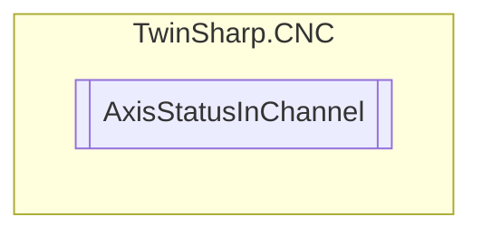

# AxisStatusInChannel `Public class`

## Description
If the axis belongs to a channel, this class can be used to get the status of the axis in that channel.

## Diagram


## Members
### Properties
#### Public  properties
| Type | Name | Methods |
| --- | --- | --- |
| `int` | [`ActualPositionPCS`](#actualpositionpcs)<br>Actual ACS position converted in the PCS. | `get` |
| [`AxisState`](./AxisState.md) | [`AxisStatePCS`](#axisstatepcs) | `get` |
| `int` | [`CommandedPositionPCS`](#commandedpositionpcs)<br>Position preset in the current cycle as setpoint. | `get` |
| `uint` | [`ContinuousSpeed`](#continuousspeed) | `get` |
| `ushort` | [`ControlElement`](#controlelement) | `get` |
| `int` | [`DistanceToGoPCS`](#distancetogopcs)<br>Distance to go in the current NC block, difference between target position and command position. | `get` |
| `int` | [`EndPositionPCS`](#endpositionpcs)<br>Target position of the current NC block. | `get` |
| `double` | [`HandwheelResolution`](#handwheelresolution) | `get` |
| `bool` | [`HomingDone`](#homingdone)<br>The axis completed homing successfully and is now referenced. | `get` |
| `uint` | [`IncrementalDistance`](#incrementaldistance) | `get` |
| `uint` | [`IncrementalSpeed`](#incrementalspeed) | `get` |
| `ushort` | [`LogicalNumber`](#logicalnumber) | `get` |
| `ushort` | [`ManualState`](#manualstate) | `get` |
| `string` | [`Name`](#name) | `get` |
| `ushort` | [`OperationMode`](#operationmode) | `get` |
| `ushort` | [`Type`](#type) | `get` |

## Details
### Summary
If the axis belongs to a channel, this class can be used to get the status of the axis in that channel.

### Constructors
#### AxisStatusInChannel
[*Source code*](https://github.com///blob//TwinSharp/CNC/AxisStatusInChannel.cs#L16)
```csharp
internal AxisStatusInChannel(AdsClient comClient, uint axisIndex)
```
##### Arguments
| Type | Name | Description |
| --- | --- | --- |
| `AdsClient` | comClient |   |
| `uint` | axisIndex |   |

### Properties
#### LogicalNumber
```csharp
public ushort LogicalNumber { get; }
```

#### Name
```csharp
public string Name { get; }
```

#### Type
```csharp
public ushort Type { get; }
```

#### DistanceToGoPCS
```csharp
public int DistanceToGoPCS { get; }
```
##### Summary
Distance to go in the current NC block, difference between target position and command position.

#### EndPositionPCS
```csharp
public int EndPositionPCS { get; }
```
##### Summary
Target position of the current NC block.

#### CommandedPositionPCS
```csharp
public int CommandedPositionPCS { get; }
```
##### Summary
Position preset in the current cycle as setpoint.

#### ActualPositionPCS
```csharp
public int ActualPositionPCS { get; }
```
##### Summary
Actual ACS position converted in the PCS.

#### HomingDone
```csharp
public bool HomingDone { get; }
```
##### Summary
The axis completed homing successfully and is now referenced.

#### AxisStatePCS
```csharp
public AxisState AxisStatePCS { get; }
```

#### ManualState
```csharp
public ushort ManualState { get; }
```

#### OperationMode
```csharp
public ushort OperationMode { get; }
```

#### ControlElement
```csharp
public ushort ControlElement { get; }
```

#### ContinuousSpeed
```csharp
public uint ContinuousSpeed { get; }
```

#### IncrementalSpeed
```csharp
public uint IncrementalSpeed { get; }
```

#### IncrementalDistance
```csharp
public uint IncrementalDistance { get; }
```

#### HandwheelResolution
```csharp
public double HandwheelResolution { get; }
```

*Generated with* [*ModularDoc*](https://github.com/hailstorm75/ModularDoc)
