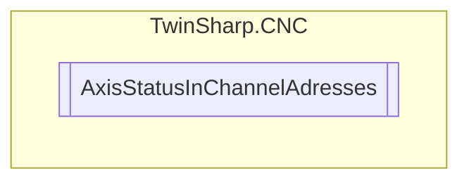

# AxisStatusInChannelAdresses `Public class`

## Diagram


## Members
### Properties
#### Public  properties
| Type | Name | Methods |
| --- | --- | --- |
| `uint` | [`ActualPositionPCS`](#actualpositionpcs) | `get` |
| `uint` | [`IndexGroup`](#indexgroup) | `get` |

## Details
### Constructors
#### AxisStatusInChannelAdresses
[*Source code*](https://github.com///blob//TwinSharp/CNC/AxisStatusInChannel.cs#L126)
```csharp
internal AxisStatusInChannelAdresses(uint axisIndex)
```
##### Arguments
| Type | Name | Description |
| --- | --- | --- |
| `uint` | axisIndex |   |

### Properties
#### IndexGroup
```csharp
public uint IndexGroup { get; }
```

#### ActualPositionPCS
```csharp
public uint ActualPositionPCS { get; }
```

*Generated with* [*ModularDoc*](https://github.com/hailstorm75/ModularDoc)
