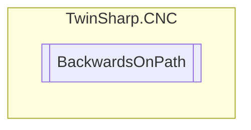

# BackwardsOnPath `Public class`

## Diagram


## Members
### Properties
#### Public  properties
| Type | Name | Methods |
| --- | --- | --- |
| `bool` | [`ActivateExternalPathVelocity`](#activateexternalpathvelocity)<br>Activate the velocity commanded in the ext_command_speed control unit. To reach the commanded velocity, all axes involved in the motion are accelerated or decelerated. If this value is TRUE, the sign is considered in the current path feed (active_feed_r control unit). | `get, set` |
| `bool` | [`EnableInterface`](#enableinterface) | `set` |
| `uint` | [`ExternalPathVelocity`](#externalpathvelocity)<br>External path velocity specified. The path velocity setting is activated by the control unit ext_command_speed_valid. If the velocity specified in negative, the tool moves backwards along the path<br>            Unit: 1 μm/s | `get, set` |
| `bool` | [`ResetBackwardMotionMemory`](#resetbackwardmotionmemory)<br>Deselects backward motion memory No further NC block is saved in the memory. The memory is deleted. The backward motion memory can only be cleared if no NC program is active. | `get, set` |
| `bool` | [`SelectBackwardMotion`](#selectbackwardmotion)<br>Select/deselect backward motion on the path In basic setting, M/H functions are executed without synchronisation(MOS) in this mode. | `get, set` |
| `bool` | [`SelectSimulatedForwardMotion`](#selectsimulatedforwardmotion)<br>Select/deselect simulated forward motion on the path In basic setting, M/H functions are executed without synchronisation (MOS) in this mode. Sections in the NC program can be skipped during program runtime in combination with the NC command #OPTIONAL EXECUTION. | `get, set` |

## Details
### Constructors
#### BackwardsOnPath
[*Source code*](https://github.com///blob//TwinSharp/CNC/CncChannel.cs#L157)
```csharp
public BackwardsOnPath(AdsClient plcClient, int channelNumber)
```
##### Arguments
| Type | Name | Description |
| --- | --- | --- |
| `AdsClient` | plcClient |   |
| `int` | channelNumber |   |

### Properties
#### SelectBackwardMotion
```csharp
public bool SelectBackwardMotion { get; set; }
```
##### Summary
Select/deselect backward motion on the path In basic setting, M/H functions are executed without synchronisation(MOS) in this mode.

#### EnableInterface
```csharp
public bool EnableInterface { set; }
```

#### SelectSimulatedForwardMotion
```csharp
public bool SelectSimulatedForwardMotion { get; set; }
```
##### Summary
Select/deselect simulated forward motion on the path In basic setting, M/H functions are executed without synchronisation (MOS) in this mode. Sections in the NC program can be skipped during program runtime in combination with the NC command #OPTIONAL EXECUTION.

#### ResetBackwardMotionMemory
```csharp
public bool ResetBackwardMotionMemory { get; set; }
```
##### Summary
Deselects backward motion memory No further NC block is saved in the memory. The memory is deleted. The backward motion memory can only be cleared if no NC program is active.

#### ExternalPathVelocity
```csharp
public uint ExternalPathVelocity { get; set; }
```
##### Summary
External path velocity specified. The path velocity setting is activated by the control unit ext_command_speed_valid. If the velocity specified in negative, the tool moves backwards along the path
            Unit: 1 μm/s

#### ActivateExternalPathVelocity
```csharp
public bool ActivateExternalPathVelocity { get; set; }
```
##### Summary
Activate the velocity commanded in the ext_command_speed control unit. To reach the commanded velocity, all axes involved in the motion are accelerated or decelerated. If this value is TRUE, the sign is considered in the current path feed (active_feed_r control unit).

*Generated with* [*ModularDoc*](https://github.com/hailstorm75/ModularDoc)
