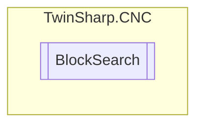

# BlockSearch `Public class`

## Diagram


## Members
### Properties
#### Public  properties
| Type | Name | Methods |
| --- | --- | --- |
| `bool` | [`AutomaticResumption`](#automaticresumption)<br>This object defines that resumption of motion on the contour occurs automatically. | `get, set` |
| `uint` | [`BlockNumberToFind`](#blocknumbertofind)<br>Defines the block number at which point actual machining is to continue. | `get, set` |
| [`BlockSearchType`](./BlockSearchType.md) | [`BlockSearchType`](#blocksearchtype) | `get, set` |
| `double` | [`BreakPoint`](#breakpoint)<br>This object defines an automatic breakpoint by specifying the distance from program start.<br>            Unit [0.1 µm] | `get, set` |
| `double` | [`CoveredDistanceFromProgramStart`](#covereddistancefromprogramstart)<br>This object defines the distance from program start or #DISTANCE PROG START CLEAR at which machining is actually supposed to start.<br>            Unit [0.1 µm] | `get, set` |
| `double` | [`CoveredDistanceMotionBlockInPerMill`](#covereddistancemotionblockinpermill)<br>This object defines the distance covered in the NC block in per mil at which machining is actually supposed to continue. The first part of the block in the block search is then executed without motion and only the remaining part is executed with moved axes. Value range: [0.0 to 1000.0]; default value= 0.0<br>            Unit [0.1%] | `get, set` |
| `uint` | [`MaxPathDeviation`](#maxpathdeviation)<br>This object defines the maximum deviation of the axes between actual position and continuation position when machining is resumed after block search. If resumption of motion on the contour is automatic, the maximum path deviation is not considered since the exact continuation position has already been reached. (Default= 0)<br>            Unit [0.1 µm] | `get, set` |
| `bool` | [`NoStopOnResumption`](#nostoponresumption)<br>This object defines whether resumption of motion on the contour should occur directly without any operator input. | `get, set` |
| `int` | [`ProgramStartAsOfFileOffset`](#programstartasoffileoffset)<br>The file offset defines a jump to a known position in the NC program. The program part before the jump point is not evaluated. Processing starts at the jump point as for a program shortened by file offset. This object defines the file offset. (Default value= 0) | `set` |

## Details
### Constructors
#### BlockSearch
[*Source code*](https://github.com///blob//TwinSharp/CNC/BlockSearch.cs#L10)
```csharp
public BlockSearch(AdsClient comClient, int channelNumber)
```
##### Arguments
| Type | Name | Description |
| --- | --- | --- |
| `AdsClient` | comClient |   |
| `int` | channelNumber |   |

### Properties
#### BlockSearchType
```csharp
public BlockSearchType BlockSearchType { get; set; }
```

#### BlockNumberToFind
```csharp
public uint BlockNumberToFind { get; set; }
```
##### Summary
Defines the block number at which point actual machining is to continue.

#### AutomaticResumption
```csharp
public bool AutomaticResumption { get; set; }
```
##### Summary
This object defines that resumption of motion on the contour occurs automatically.

#### NoStopOnResumption
```csharp
public bool NoStopOnResumption { get; set; }
```
##### Summary
This object defines whether resumption of motion on the contour should occur directly without any operator input.

#### MaxPathDeviation
```csharp
public uint MaxPathDeviation { get; set; }
```
##### Summary
This object defines the maximum deviation of the axes between actual position and continuation position when machining is resumed after block search. If resumption of motion on the contour is automatic, the maximum path deviation is not considered since the exact continuation position has already been reached. (Default= 0)
            Unit [0.1 µm]

#### ProgramStartAsOfFileOffset
```csharp
public int ProgramStartAsOfFileOffset { set; }
```
##### Summary
The file offset defines a jump to a known position in the NC program. The program part before the jump point is not evaluated. Processing starts at the jump point as for a program shortened by file offset. This object defines the file offset. (Default value= 0)

#### BreakPoint
```csharp
public double BreakPoint { get; set; }
```
##### Summary
This object defines an automatic breakpoint by specifying the distance from program start.
            Unit [0.1 µm]

#### CoveredDistanceFromProgramStart
```csharp
public double CoveredDistanceFromProgramStart { get; set; }
```
##### Summary
This object defines the distance from program start or #DISTANCE PROG START CLEAR at which machining is actually supposed to start.
            Unit [0.1 µm]

#### CoveredDistanceMotionBlockInPerMill
```csharp
public double CoveredDistanceMotionBlockInPerMill { get; set; }
```
##### Summary
This object defines the distance covered in the NC block in per mil at which machining is actually supposed to continue. The first part of the block in the block search is then executed without motion and only the remaining part is executed with moved axes. Value range: [0.0 to 1000.0]; default value= 0.0
            Unit [0.1%]

*Generated with* [*ModularDoc*](https://github.com/hailstorm75/ModularDoc)
