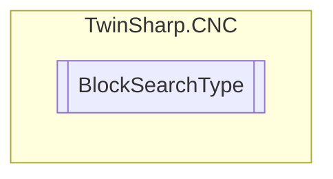

# BlockSearchType `Public enum`

## Diagram

## Details
### Fields
#### NoBlockSearch

#### FileOffset

#### BlockCounter

#### BlockNumber

#### ProgramEnd

*Generated with* [*ModularDoc*](https://github.com/hailstorm75/ModularDoc)
