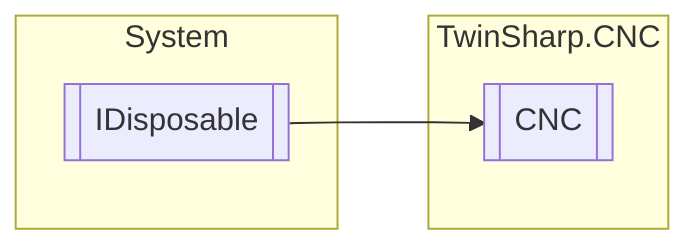

# CNC `Public class`

## Diagram


## Members
### Methods
#### Public  methods
| Returns | Name |
| --- | --- |
| `void` | [`Dispose`](#dispose)() |

## Details
### Inheritance
 - `IDisposable`

### Constructors
#### CNC
[*Source code*](https://github.com///blob//TwinSharp/CNC/CNC.cs#L17)
```csharp
public CNC(AmsNetId target)
```
##### Arguments
| Type | Name | Description |
| --- | --- | --- |
| `AmsNetId` | target |   |

### Methods
#### Dispose
[*Source code*](https://github.com///blob//TwinSharp/CNC/CNC.cs#L89)
```csharp
public virtual void Dispose()
```

*Generated with* [*ModularDoc*](https://github.com/hailstorm75/ModularDoc)
