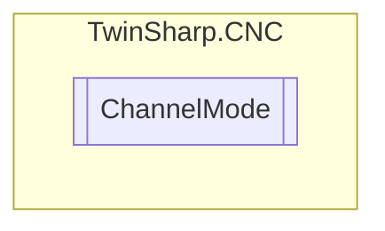

# ChannelMode `Public enum`

## Diagram

## Details
### Fields
#### ISG_STANDARD

#### SOLLKON_BlockSearch

#### SOLLKON_NominalContourVisualisation

#### SOLLKON_SuppressOutput

#### ON_LINE

#### SYNCHK

#### PROD_TIME

#### ONLINE_PROD_TIME

#### MACHINE_LOCK

#### ADD_MDI_BLOCK

#### KIN_TRAFO_OFF

#### BEARB_MODE_SCENE

#### SUPPRESS_TECHNO_OUTPUT

*Generated with* [*ModularDoc*](https://github.com/hailstorm75/ModularDoc)
