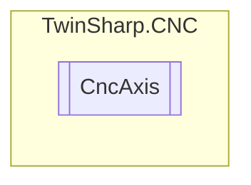

# CncAxis `Public class`

## Diagram


## Members
### Methods
#### Public  methods
| Returns | Name |
| --- | --- |
| `string` | [`GetParameters`](#getparameters)() |
| `void` | [`JogPositiveSlow`](#jogpositiveslow)() |
| `void` | [`JogStop`](#jogstop)() |
| `string` | [`ToString`](#tostring)() |

## Details
### Constructors
#### CncAxis
[*Source code*](https://github.com///blob//TwinSharp/CNC/CncAxis.cs#L16)
```csharp
internal CncAxis(uint number, AmsNetId target, AdsClient plcClient, AdsClient comClient)
```
##### Arguments
| Type | Name | Description |
| --- | --- | --- |
| `uint` | number |   |
| `AmsNetId` | target |   |
| `AdsClient` | plcClient |   |
| `AdsClient` | comClient |   |

### Methods
#### GetParameters
[*Source code*](https://github.com///blob//TwinSharp/CNC/CncAxis.cs#L30)
```csharp
public string GetParameters()
```

#### JogPositiveSlow
[*Source code*](https://github.com///blob//TwinSharp/CNC/CncAxis.cs#L60)
```csharp
public void JogPositiveSlow()
```

#### JogStop
[*Source code*](https://github.com///blob//TwinSharp/CNC/CncAxis.cs#L65)
```csharp
public void JogStop()
```

#### ToString
[*Source code*](https://github.com///blob//TwinSharp/CNC/CncAxis.cs#L72)
```csharp
public override string ToString()
```

*Generated with* [*ModularDoc*](https://github.com/hailstorm75/ModularDoc)
