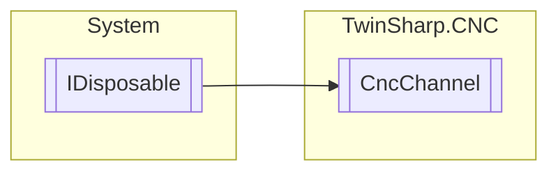

# CncChannel `Public class`

## Diagram


## Members
### Properties
#### Public  properties
| Type | Name | Methods |
| --- | --- | --- |
| `double` | [`CoveredBlockMotionPercent`](#coveredblockmotionpercent)<br>Part of the path motion traversed in the current block in relation to the total path.<br>            If a main axis participates in the motion, the covered path motion is in relation to the block path of the first three axes. If no main axis participates in the motion, the covered path motion is the position lag with the longest motion time in relation to the block path. | `get` |
| `double` | [`CoveredPathDistance`](#coveredpathdistance)<br>Reads the current distance covered in the NC program since program start or since the last # DISTANCE PROG START CLEAR NC command. The calculation is based on the current position in the current NC block.<br>            Unit: 0.1 µm | `get` |
| `uint` | [`LineCountNcProgram`](#linecountncprogram)<br>The datum indicates the NC program line which is the source of the command just processed by the interpolator.<br>            The value is derived from the number of NC program lines which the decoder has read since the NC program started. All the lines read the decoder are counted, i.e.repeatedly read lines, empty and comment lines. All commands to the interpolator resulting from decoding a NC program line are assigned to the associated line counter. | `get` |
| `double` | [`PathFeedProgrammed`](#pathfeedprogrammed)<br>Path feed that was was programmed by the F word in the NC program..<br>            Unit: 1 µm/s | `get` |
| `double` | [`PathFeedProgrammedWeighted`](#pathfeedprogrammedweighted) | `get` |

### Methods
#### Public  methods
| Returns | Name |
| --- | --- |
| `void` | [`Dispose`](#dispose)() |

## Details
### Inheritance
 - `IDisposable`

### Constructors
#### CncChannel
[*Source code*](https://github.com///blob//TwinSharp/CNC/CncChannel.cs#L27)
```csharp
internal CncChannel(AdsClient plcClient, AdsClient geoClient, AdsClient sdaClient, AdsClient comClient, int channelNumber, Dictionary<string, ObjectDescription> descriptions)
```
##### Arguments
| Type | Name | Description |
| --- | --- | --- |
| `AdsClient` | plcClient |   |
| `AdsClient` | geoClient |   |
| `AdsClient` | sdaClient |   |
| `AdsClient` | comClient |   |
| `int` | channelNumber |   |
| `Dictionary`&lt;`string`, [`ObjectDescription`](./ObjectDescription.md)&gt; | descriptions |   |

### Methods
#### Dispose
[*Source code*](https://github.com///blob//TwinSharp/CNC/CncChannel.cs#L118)
```csharp
public virtual void Dispose()
```

### Properties
#### CoveredBlockMotionPercent
```csharp
public double CoveredBlockMotionPercent { get; }
```
##### Summary
Part of the path motion traversed in the current block in relation to the total path.
            If a main axis participates in the motion, the covered path motion is in relation to the block path of the first three axes. If no main axis participates in the motion, the covered path motion is the position lag with the longest motion time in relation to the block path.

#### CoveredPathDistance
```csharp
public double CoveredPathDistance { get; }
```
##### Summary
Reads the current distance covered in the NC program since program start or since the last # DISTANCE PROG START CLEAR NC command. The calculation is based on the current position in the current NC block.
            Unit: 0.1 µm

#### LineCountNcProgram
```csharp
public uint LineCountNcProgram { get; }
```
##### Summary
The datum indicates the NC program line which is the source of the command just processed by the interpolator.
            The value is derived from the number of NC program lines which the decoder has read since the NC program started. All the lines read the decoder are counted, i.e.repeatedly read lines, empty and comment lines. All commands to the interpolator resulting from decoding a NC program line are assigned to the associated line counter.

#### PathFeedProgrammed
```csharp
public double PathFeedProgrammed { get; }
```
##### Summary
Path feed that was was programmed by the F word in the NC program..
            Unit: 1 µm/s

#### PathFeedProgrammedWeighted
```csharp
public double PathFeedProgrammedWeighted { get; }
```

*Generated with* [*ModularDoc*](https://github.com/hailstorm75/ModularDoc)
