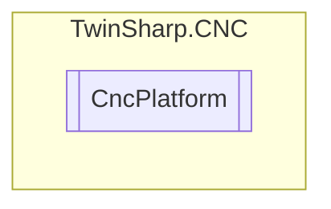

# CncPlatform `Public class`

## Diagram


## Members
### Properties
#### Public  properties
| Type | Name | Methods |
| --- | --- | --- |
| `uint` | [`AxisCount`](#axiscount) | `get` |
| `ushort` | [`ChannelCount`](#channelcount) | `get` |
| `uint` | [`CycleTime`](#cycletime) | `get` |
| `uint` | [`MaxAxisCount`](#maxaxiscount) | `get` |
| `ushort` | [`MaxChannelCount`](#maxchannelcount) | `get` |
| `uint` | [`MaxSpindleCount`](#maxspindlecount) | `get` |
| `uint` | [`TickCounter`](#tickcounter) | `get` |
| `string` | [`Version`](#version) | `get` |

## Details
### Constructors
#### CncPlatform
[*Source code*](https://github.com///blob//TwinSharp/CNC/CncPlatform.cs#L9)
```csharp
internal CncPlatform(AdsClient comClient, Dictionary<string, ObjectDescription> descriptions)
```
##### Arguments
| Type | Name | Description |
| --- | --- | --- |
| `AdsClient` | comClient |   |
| `Dictionary`&lt;`string`, [`ObjectDescription`](./ObjectDescription.md)&gt; | descriptions |   |

### Properties
#### TickCounter
```csharp
public uint TickCounter { get; }
```

#### CycleTime
```csharp
public uint CycleTime { get; }
```

#### Version
```csharp
public string Version { get; }
```

#### AxisCount
```csharp
public uint AxisCount { get; }
```

#### ChannelCount
```csharp
public ushort ChannelCount { get; }
```

#### MaxAxisCount
```csharp
public uint MaxAxisCount { get; }
```

#### MaxSpindleCount
```csharp
public uint MaxSpindleCount { get; }
```

#### MaxChannelCount
```csharp
public ushort MaxChannelCount { get; }
```

*Generated with* [*ModularDoc*](https://github.com/hailstorm75/ModularDoc)
