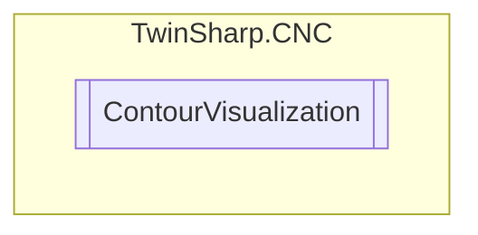

# ContourVisualization `Public class`

## Diagram


## Members
### Properties
#### Public  properties
| Type | Name | Methods |
| --- | --- | --- |
| `byte``[]` | [`DataRecordChannelFIFO`](#datarecordchannelfifo) | `get` |
| `uint` | [`DataRecordCountChannelFIFO`](#datarecordcountchannelfifo) | `get` |
| `uint` | [`DataRecordCountGlobalFIFO`](#datarecordcountglobalfifo) | `get` |
| [`ChannelMode`](./ChannelMode.md) | [`ExecutionMode`](#executionmode)<br>Select nominal contour visualisation<br>            0x0000 ISG_STANDARD Normal mode<br>            0x0002 SOLLKON Nominal contour visualisation<br>            0x0004 ON_LINE Online-Visu<br>            0x0008 SYNCHK Syntax check | `get, set` |
| `double` | [`MaxAbsolutePathError`](#maxabsolutepatherror)<br>Maximum absolute path error in [0.1 µm] for nominal contour visualisation of circles and polynomials | `set` |
| `double` | [`MaxRelativePathError`](#maxrelativepatherror)<br>Maximum relative path error in [0.1%] for nominal contour visualisation of circles or polynomials | `set` |
| `uint` | [`OutputGridSize`](#outputgridsize)<br>Output grid for nominal contour visualisation for linear blocks(G00/G01) in [0.1 µm] | `get, set` |

### Methods
#### Public  methods
| Returns | Name |
| --- | --- |
| `int` | [`GetDataRecordFromGlobalFIFO`](#getdatarecordfromglobalfifo)(`Memory`&lt;`byte`&gt; bufferToFill) |

## Details
### Constructors
#### ContourVisualization
[*Source code*](https://github.com///blob//TwinSharp/CNC/CncChannel.cs#L443)
```csharp
internal ContourVisualization(AdsClient comClient, int channelID)
```
##### Arguments
| Type | Name | Description |
| --- | --- | --- |
| `AdsClient` | comClient |   |
| `int` | channelID |   |

### Methods
#### GetDataRecordFromGlobalFIFO
[*Source code*](https://github.com///blob//TwinSharp/CNC/CncChannel.cs#L499)
```csharp
public int GetDataRecordFromGlobalFIFO(Memory<byte> bufferToFill)
```
##### Arguments
| Type | Name | Description |
| --- | --- | --- |
| `Memory`&lt;`byte`&gt; | bufferToFill |   |

### Properties
#### ExecutionMode
```csharp
public ChannelMode ExecutionMode { get; set; }
```
##### Summary
Select nominal contour visualisation
            0x0000 ISG_STANDARD Normal mode
            0x0002 SOLLKON Nominal contour visualisation
            0x0004 ON_LINE Online-Visu
            0x0008 SYNCHK Syntax check

#### OutputGridSize
```csharp
public uint OutputGridSize { get; set; }
```
##### Summary
Output grid for nominal contour visualisation for linear blocks(G00/G01) in [0.1 µm]

#### MaxRelativePathError
```csharp
public double MaxRelativePathError { set; }
```
##### Summary
Maximum relative path error in [0.1%] for nominal contour visualisation of circles or polynomials

#### MaxAbsolutePathError
```csharp
public double MaxAbsolutePathError { set; }
```
##### Summary
Maximum absolute path error in [0.1 µm] for nominal contour visualisation of circles and polynomials

#### DataRecordChannelFIFO
```csharp
public byte DataRecordChannelFIFO { get; }
```

#### DataRecordCountChannelFIFO
```csharp
public uint DataRecordCountChannelFIFO { get; }
```

#### DataRecordCountGlobalFIFO
```csharp
public uint DataRecordCountGlobalFIFO { get; }
```

*Generated with* [*ModularDoc*](https://github.com/hailstorm75/ModularDoc)
