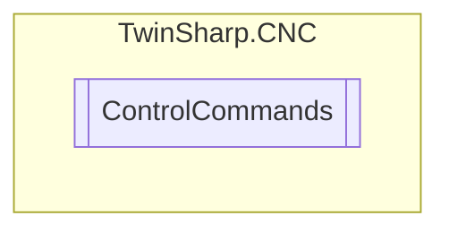

# ControlCommands `Public class`

## Diagram


## Members
### Properties
#### Public  properties
| Type | Name | Methods |
| --- | --- | --- |
| [`ChannelMode`](./ChannelMode.md) | [`ChannelModeActive`](#channelmodeactive)<br>Current special channel mode such as syntax check or machining time calculation | `get` |
| [`ChannelMode`](./ChannelMode.md) | [`ChannelModeCommanded`](#channelmodecommanded)<br>Selection of a special channel mode such as syntax check or machining time calculation | `get, set` |
| `bool` | [`OptionalStop`](#optionalstop)<br>Activating/deactivating optional stop.<br>            If the function M01(optional stop) is programmed in the current block of the NC program, set this element to the value TRUE to stop at block end (ramped-down deceleration complying with the permissible accelerations).<br>            The following block can be enabled by activating the element “continue machining” if the NC kernel indicates that all axes are located within the control window by resetting the status flag wait_axes_in_position_r. | `get, set` |
| [`SkipModes`](./SkipModes.md) | [`SkipMode`](#skipmode)<br>Activates/deactivates skip mode at interpreter level for the NC program. The status of skip mode is only evaluated at the start of the NC program. Switchover during execution of an NC program has no effect.<br>            Skip levels active simultaneously are enabled by bitwise ORing.<br>            Example:<br>            Enable all skip levels by setting 0x3FF. | `get, set` |

## Details
### Constructors
#### ControlCommands
[*Source code*](https://github.com///blob//TwinSharp/CNC/CncChannel.cs#L339)
```csharp
internal ControlCommands(AdsClient comClient, Dictionary<string, ObjectDescription> descriptions)
```
##### Arguments
| Type | Name | Description |
| --- | --- | --- |
| `AdsClient` | comClient |   |
| `Dictionary`&lt;`string`, [`ObjectDescription`](./ObjectDescription.md)&gt; | descriptions |   |

### Properties
#### SkipMode
```csharp
public SkipModes SkipMode { get; set; }
```
##### Summary
Activates/deactivates skip mode at interpreter level for the NC program. The status of skip mode is only evaluated at the start of the NC program. Switchover during execution of an NC program has no effect.
            Skip levels active simultaneously are enabled by bitwise ORing.
            Example:
            Enable all skip levels by setting 0x3FF.

#### ChannelModeActive
```csharp
public ChannelMode ChannelModeActive { get; }
```
##### Summary
Current special channel mode such as syntax check or machining time calculation

#### ChannelModeCommanded
```csharp
public ChannelMode ChannelModeCommanded { get; set; }
```
##### Summary
Selection of a special channel mode such as syntax check or machining time calculation

#### OptionalStop
```csharp
public bool OptionalStop { get; set; }
```
##### Summary
Activating/deactivating optional stop.
            If the function M01(optional stop) is programmed in the current block of the NC program, set this element to the value TRUE to stop at block end (ramped-down deceleration complying with the permissible accelerations).
            The following block can be enabled by activating the element “continue machining” if the NC kernel indicates that all axes are located within the control window by resetting the status flag wait_axes_in_position_r.

*Generated with* [*ModularDoc*](https://github.com/hailstorm75/ModularDoc)
