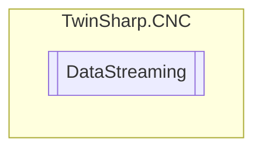

# DataStreaming `Public class`

## Diagram


## Members
### Methods
#### Public  methods
| Returns | Name |
| --- | --- |
| `void` | [`Write`](#write)(`string` ncLines)<br>This COM interface object can write the data stream with incremental NC commands.<br>            One complete NC line must always be written.Several NC lines may also be written jointly in one write access.<br>            Each NC line must be terminated by a carriage return (ASCII value = 13) and line feed(ASCII value = 10). |

## Details
### Constructors
#### DataStreaming
[*Source code*](https://github.com///blob//TwinSharp/CNC/CncChannel.cs#L130)
```csharp
public DataStreaming(AdsClient comClient, int channelNumber)
```
##### Arguments
| Type | Name | Description |
| --- | --- | --- |
| `AdsClient` | comClient |   |
| `int` | channelNumber |   |

### Methods
#### Write
[*Source code*](https://github.com///blob//TwinSharp/CNC/CncChannel.cs#L146)
```csharp
public void Write(string ncLines)
```
##### Arguments
| Type | Name | Description |
| --- | --- | --- |
| `string` | ncLines |  |

##### Summary
This COM interface object can write the data stream with incremental NC commands.
            One complete NC line must always be written.Several NC lines may also be written jointly in one write access.
            Each NC line must be terminated by a carriage return (ASCII value = 13) and line feed(ASCII value = 10).

*Generated with* [*ModularDoc*](https://github.com/hailstorm75/ModularDoc)
