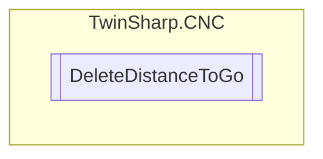

# DeleteDistanceToGo `Public class`

## Diagram


## Members
### Properties
#### Public  properties
| Type | Name | Methods |
| --- | --- | --- |
| `bool` | [`Delete`](#delete)<br>The rising edge of the commanded value has the effect that the CNC channel is decelerated to feed velocity 0. Then a linear motion is executed to the target position of the next motion block (short cut). The command only affects motion blocks. | `get, set` |
| `bool` | [`InterfaceExists`](#interfaceexists) | `set` |

## Details
### Constructors
#### DeleteDistanceToGo
[*Source code*](https://github.com///blob//TwinSharp/CNC/DeleteDistanceToGo.cs#L11)
```csharp
public DeleteDistanceToGo(AdsClient plcClient, int channelNumber)
```
##### Arguments
| Type | Name | Description |
| --- | --- | --- |
| `AdsClient` | plcClient |   |
| `int` | channelNumber |   |

### Properties
#### Delete
```csharp
public bool Delete { get; set; }
```
##### Summary
The rising edge of the commanded value has the effect that the CNC channel is decelerated to feed velocity 0. Then a linear motion is executed to the target position of the next motion block (short cut). The command only affects motion blocks.

#### InterfaceExists
```csharp
public bool InterfaceExists { set; }
```

*Generated with* [*ModularDoc*](https://github.com/hailstorm75/ModularDoc)
