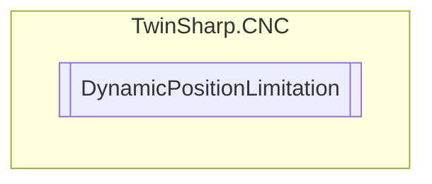

# DynamicPositionLimitation `Public class`

## Description
Additionally needs to be activated in the startup parameters by using the keyword FCT_DYN_POS_LIMIT of the parameter P-STUP-00070

## Diagram


## Members
### Properties
#### Public  properties
| Type | Name | Methods |
| --- | --- | --- |
| [`HLI_DYNPL_STATE`](./HLI_DYNPL_STATE.md) | [`LowerPositionLimitMonitoringState`](#lowerpositionlimitmonitoringstate) | `get` |

### Methods
#### Public  methods
| Returns | Name |
| --- | --- |
| `void` | [`LowerPositionLimitInterfaceExists`](#lowerpositionlimitinterfaceexists)(`bool` enabled) |
| `void` | [`SetLowerPositionLimit`](#setlowerpositionlimit)(`int` position)<br>Sets a position value and describes the lower limit of the position range which the axis should not exceed. |

## Details
### Summary
Additionally needs to be activated in the startup parameters by using the keyword FCT_DYN_POS_LIMIT of the parameter P-STUP-00070

### Constructors
#### DynamicPositionLimitation
[*Source code*](https://github.com///blob//TwinSharp/CNC/DynamicPositionLimitation.cs#L15)
```csharp
public DynamicPositionLimitation(uint axisIndex, AdsClient plcClient)
```
##### Arguments
| Type | Name | Description |
| --- | --- | --- |
| `uint` | axisIndex |   |
| `AdsClient` | plcClient |   |

### Methods
#### LowerPositionLimitInterfaceExists
[*Source code*](https://github.com///blob//TwinSharp/CNC/DynamicPositionLimitation.cs#L24)
```csharp
public void LowerPositionLimitInterfaceExists(bool enabled)
```
##### Arguments
| Type | Name | Description |
| --- | --- | --- |
| `bool` | enabled |   |

#### SetLowerPositionLimit
[*Source code*](https://github.com///blob//TwinSharp/CNC/DynamicPositionLimitation.cs#L36)
```csharp
public void SetLowerPositionLimit(int position)
```
##### Arguments
| Type | Name | Description |
| --- | --- | --- |
| `int` | position | Unit: 0.1 µm or 10-4 ° |

##### Summary
Sets a position value and describes the lower limit of the position range which the axis should not exceed.

### Properties
#### LowerPositionLimitMonitoringState
```csharp
public HLI_DYNPL_STATE LowerPositionLimitMonitoringState { get; }
```

*Generated with* [*ModularDoc*](https://github.com/hailstorm75/ModularDoc)
