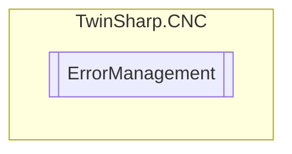

# ErrorManagement `Public class`

## Diagram


## Details
### Constructors
#### ErrorManagement
[*Source code*](https://github.com///blob//TwinSharp/CNC/ErrorManagement.cs#L14)
```csharp
public ErrorManagement(AdsClient plcClient, int channelNumber)
```
##### Arguments
| Type | Name | Description |
| --- | --- | --- |
| `AdsClient` | plcClient |   |
| `int` | channelNumber |   |

### Events
#### ErrorRecieved
```csharp
public event EventHandler<ErrorRecievedEventArgs> ErrorRecieved
```

*Generated with* [*ModularDoc*](https://github.com/hailstorm75/ModularDoc)
