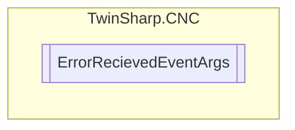

# ErrorRecievedEventArgs `Public class`

## Diagram


## Details
### Constructors
#### ErrorRecievedEventArgs
[*Source code*](https://github.com///blob//TwinSharp/CNC/ErrorManagement.cs#L83)
```csharp
internal ErrorRecievedEventArgs(HLI_ERROR_SATZ_KOPF error, string description)
```
##### Arguments
| Type | Name | Description |
| --- | --- | --- |
| [`HLI_ERROR_SATZ_KOPF`](./HLI_ERROR_SATZ_KOPF.md) | error |   |
| `string` | description |   |

*Generated with* [*ModularDoc*](https://github.com/hailstorm75/ModularDoc)
