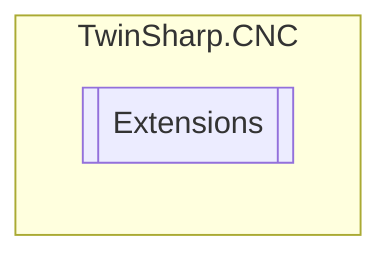

# Extensions `Public class`

## Diagram


## Members
### Methods
#### Public Static methods
| Returns | Name |
| --- | --- |
| `T` | [`ByteArrayToStructure`](#bytearraytostructure)(`byte``[]` bytes) |

## Details
### Methods
#### ByteArrayToStructure
[*Source code*](https://github.com///blob//TwinSharp/CNC/Extensions.cs#L8)
```csharp
public static T ByteArrayToStructure<T>(byte[] bytes)
where T : ValueType
```
##### Arguments
| Type | Name | Description |
| --- | --- | --- |
| `byte``[]` | bytes |   |

*Generated with* [*ModularDoc*](https://github.com/hailstorm75/ModularDoc)
