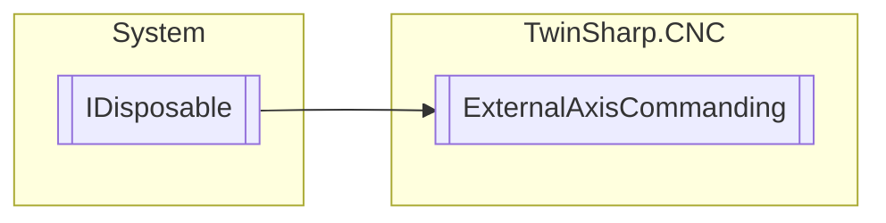

# ExternalAxisCommanding `Public class`

## Description
Specifying velocity or position command values by the PLC effective in addition to the interpolator. No monitoring takes place of transferred values for compliance with the dynamic axis limits. To activate this interface, set the parameter P-AXIS-00732 to 1.

## Diagram


## Members
### Properties
#### Public  properties
| Type | Name | Methods |
| --- | --- | --- |
| `int` | [`AdditivePosition`](#additiveposition)<br>Unit 0.1 µm | `set` |
| `int` | [`AdditiveVelocity`](#additivevelocity)<br>Unit 1 µm/s | `set` |
| `bool` | [`InterfaceExists`](#interfaceexists) | `set` |

### Methods
#### Public  methods
| Returns | Name |
| --- | --- |
| `void` | [`Dispose`](#dispose)() |

## Details
### Summary
Specifying velocity or position command values by the PLC effective in addition to the interpolator. No monitoring takes place of transferred values for compliance with the dynamic axis limits. To activate this interface, set the parameter P-AXIS-00732 to 1.

### Inheritance
 - `IDisposable`

### Constructors
#### ExternalAxisCommanding
[*Source code*](https://github.com///blob//TwinSharp/CNC/ExternalAxisCommanding.cs#L13)
```csharp
public ExternalAxisCommanding(uint index, AdsClient plcClient)
```
##### Arguments
| Type | Name | Description |
| --- | --- | --- |
| `uint` | index |   |
| `AdsClient` | plcClient |   |

### Methods
#### Dispose
[*Source code*](https://github.com///blob//TwinSharp/CNC/ExternalAxisCommanding.cs#L74)
```csharp
public virtual void Dispose()
```

### Properties
#### InterfaceExists
```csharp
public bool InterfaceExists { set; }
```

#### AdditivePosition
```csharp
public int AdditivePosition { set; }
```
##### Summary
Unit 0.1 µm

#### AdditiveVelocity
```csharp
public int AdditiveVelocity { set; }
```
##### Summary
Unit 1 µm/s

*Generated with* [*ModularDoc*](https://github.com/hailstorm75/ModularDoc)
