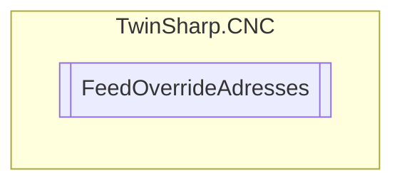

# FeedOverrideAdresses `Public class`

## Diagram


## Members
### Properties
#### Public  properties
| Type | Name | Methods |
| --- | --- | --- |
| `uint` | [`ActualFeedOverride`](#actualfeedoverride) | `get` |
| `uint` | [`IndexGroup`](#indexgroup) | `get` |

## Details
### Constructors
#### FeedOverrideAdresses
[*Source code*](https://github.com///blob//TwinSharp/CNC/CncChannel.cs#L310)
```csharp
internal FeedOverrideAdresses(uint indexGroup)
```
##### Arguments
| Type | Name | Description |
| --- | --- | --- |
| `uint` | indexGroup |   |

### Properties
#### IndexGroup
```csharp
public uint IndexGroup { get; }
```

#### ActualFeedOverride
```csharp
public uint ActualFeedOverride { get; }
```

*Generated with* [*ModularDoc*](https://github.com/hailstorm75/ModularDoc)
