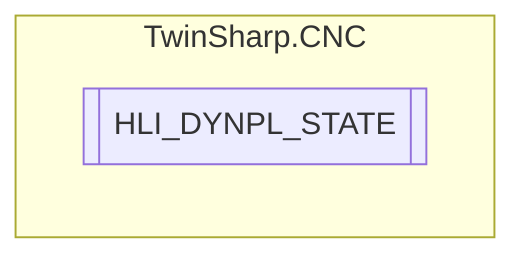

# HLI_DYNPL_STATE `Public enum`

## Diagram

## Details
### Fields
#### HLI_DYNPL_STATE_INACTIVE

#### HLI_DYNPL_STATE_ACTIVATION

#### HLI_DYNPL_STATE_ACTIVE

#### HLI_DYNPL_STATE_ACTIVE_BRAKING

#### HLI_DYNPL_STATE_ACTIVE_BRAKE

*Generated with* [*ModularDoc*](https://github.com/hailstorm75/ModularDoc)
