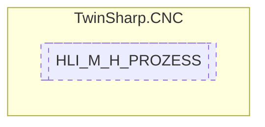

# HLI_M_H_PROZESS `Public struct`

## Description
Further describes the TECHNO_UNIT_CH struct when it is a M or H function.

## Diagram

## Details
### Summary
Further describes the TECHNO_UNIT_CH struct when it is a M or H function.

*Generated with* [*ModularDoc*](https://github.com/hailstorm75/ModularDoc)
