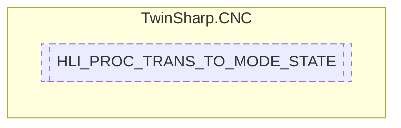

# HLI_PROC_TRANS_TO_MODE_STATE `Public struct`

## Description
Control unit to switch over the operation mode and poll the current state of operation mode management, including flow control of user data.

## Diagram

## Details
### Summary
Control unit to switch over the operation mode and poll the current state of operation mode management, including flow control of user data.

*Generated with* [*ModularDoc*](https://github.com/hailstorm75/ModularDoc)
