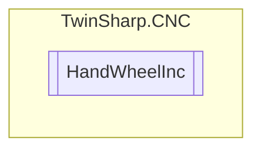

# HandWheelInc `Public class`

## Diagram


## Members
### Methods
#### Public  methods
| Returns | Name |
| --- | --- |
| `void` | [`EnableControlElement`](#enablecontrolelement)(`bool` enabled) |
| `void` | [`WriteCommandElement`](#writecommandelement)(`short` data) |

## Details
### Constructors
#### HandWheelInc
[*Source code*](https://github.com///blob//TwinSharp/CNC/ManualOperation.cs#L109)
```csharp
public HandWheelInc(AdsClient plcClient, int channelNumber, int handWheelIndex)
```
##### Arguments
| Type | Name | Description |
| --- | --- | --- |
| `AdsClient` | plcClient |   |
| `int` | channelNumber |   |
| `int` | handWheelIndex |   |

### Methods
#### EnableControlElement
[*Source code*](https://github.com///blob//TwinSharp/CNC/ManualOperation.cs#L117)
```csharp
public void EnableControlElement(bool enabled)
```
##### Arguments
| Type | Name | Description |
| --- | --- | --- |
| `bool` | enabled |   |

#### WriteCommandElement
[*Source code*](https://github.com///blob//TwinSharp/CNC/ManualOperation.cs#L124)
```csharp
public void WriteCommandElement(short data)
```
##### Arguments
| Type | Name | Description |
| --- | --- | --- |
| `short` | data |   |

*Generated with* [*ModularDoc*](https://github.com/hailstorm75/ModularDoc)
