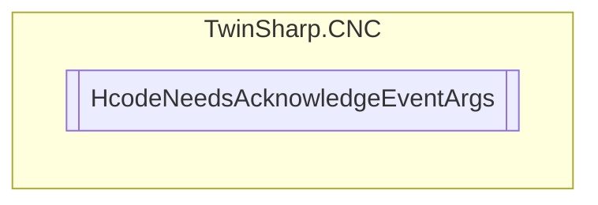

# HcodeNeedsAcknowledgeEventArgs `Public class`

## Diagram


## Details
### Constructors
#### HcodeNeedsAcknowledgeEventArgs
[*Source code*](https://github.com///blob//TwinSharp/CNC/TechnologyProcesses.cs#L200)
```csharp
public HcodeNeedsAcknowledgeEventArgs(HLI_M_H_PROZESS mHProcess)
```
##### Arguments
| Type | Name | Description |
| --- | --- | --- |
| [`HLI_M_H_PROZESS`](./HLI_M_H_PROZESS.md) | mHProcess |   |

*Generated with* [*ModularDoc*](https://github.com/hailstorm75/ModularDoc)
