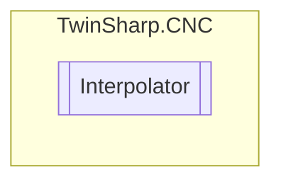

# Interpolator `Public class`

## Diagram


## Members
### Properties
#### Public  properties
| Type | Name | Methods |
| --- | --- | --- |
| `int` | [`ActualBlockCount`](#actualblockcount) | `get` |
| `uint` | [`ActualDWord`](#actualdword) | `get` |
| `byte` | [`ActualStateOfInterpolator`](#actualstateofinterpolator) | `get` |
| `double` | [`ActualToolRadius`](#actualtoolradius) | `get` |
| `double` | [`ActualVelocityOnPath`](#actualvelocityonpath) | `get` |
| `ushort` | [`ActualZeroOffsetGroup`](#actualzerooffsetgroup) | `get` |
| `uint` | [`AdditionalStatus`](#additionalstatus) | `get` |
| `ushort` | [`AxisCount`](#axiscount) | `get` |
| `int` | [`BendAngleAtBlockEnd`](#bendangleatblockend) | `get` |
| `bool` | [`BlockEndActive`](#blockendactive) | `get` |
| `double` | [`BlockLengthOnPath`](#blocklengthonpath) | `get` |
| `int` | [`BlockNumberActual`](#blocknumberactual) | `get` |
| `bool` | [`CartesianTransformationActive`](#cartesiantransformationactive) | `get` |
| `bool` | [`CaxFunctionAligningActive`](#caxfunctionaligningactive) | `get` |
| `ushort` | [`CommandBFOverride`](#commandbfoverride) | `get` |
| `ushort` | [`CommandFBOverride`](#commandfboverride) | `get` |
| `double` | [`CoveredDistance`](#covereddistance) | `get` |
| `double` | [`DistanceFromProgramStart`](#distancefromprogramstart) | `get` |
| `double` | [`Druckwinkel`](#druckwinkel) | `get` |
| `double` | [`DwellTimeCommanded`](#dwelltimecommanded) | `get` |
| `double` | [`DwellTimeRemaning`](#dwelltimeremaning) | `get, set` |
| `uint` | [`DynamicLimit`](#dynamiclimit) | `get` |
| `double` | [`DynamicWeightG129`](#dynamicweightg129) | `get` |
| `double` | [`DynamicWeightG131`](#dynamicweightg131) | `get` |
| `double` | [`DynamicWeightG133`](#dynamicweightg133) | `get` |
| `double` | [`DynamicWeightG134`](#dynamicweightg134) | `get` |
| `double` | [`DynamicWeightG231`](#dynamicweightg231) | `get` |
| `double` | [`DynamicWeightG233`](#dynamicweightg233) | `get` |
| `bool` | [`Exists`](#exists) | `get` |
| `double` | [`FeedOfSyncAxis`](#feedofsyncaxis) | `get` |
| `ushort` | [`GlobalEnabledAxesCount`](#globalenabledaxescount) | `get` |
| `double` | [`HscFilterDelayTimeIpo`](#hscfilterdelaytimeipo) | `get` |
| `bool` | [`HscFilterOn`](#hscfilteron) | `get` |
| `uint` | [`HscFilterOrder`](#hscfilterorder) | `get` |
| `bool` | [`HscSurfaceActive`](#hscsurfaceactive) | `get` |
| `uint` | [`HscSurfaceCheckJerk`](#hscsurfacecheckjerk) | `get` |
| `bool` | [`HscSurfaceFAutoOffG00`](#hscsurfacefautooffg00) | `get` |
| `double` | [`HscSurfaceMaxAngle`](#hscsurfacemaxangle) | `get` |
| `double` | [`HscSurfacePathDev`](#hscsurfacepathdev) | `get` |
| `double` | [`HscSurfaceTrackDev`](#hscsurfacetrackdev) | `get` |
| `uint` | [`IpoBufLevel`](#ipobuflevel) | `get` |
| `uint` | [`IpoSyncWaitState`](#iposyncwaitstate) | `get` |
| `bool` | [`KinematicalTransformationActive`](#kinematicaltransformationactive) | `get` |
| `int` | [`LatestInputBlockCount`](#latestinputblockcount) | `get` |
| `uint` | [`LimitingAxis`](#limitingaxis) | `get` |
| `uint` | [`ManualAcsAxesMovementLimitation`](#manualacsaxesmovementlimitation) | `get` |
| `uint` | [`ManualPcsAxesMovementLimitation`](#manualpcsaxesmovementlimitation) | `get` |
| `bool` | [`ManualWaitPositionInitializationDone`](#manualwaitpositioninitializationdone) | `get` |
| `uint` | [`MaximumVelocityOnPath`](#maximumvelocityonpath) | `get` |
| `uint` | [`MaximumVelocityOnPathAtBlockEnd`](#maximumvelocityonpathatblockend) | `get` |
| `bool` | [`MeasuringActive`](#measuringactive) | `get` |
| `uint` | [`MotionCtrl`](#motionctrl) | `get` |
| `uint` | [`MotionCtrl2`](#motionctrl2) | `get` |
| `double` | [`MovedPath`](#movedpath) | `get` |
| `double` | [`OverrideFeedFactor`](#overridefeedfactor) | `get` |
| `double` | [`PathfeedInSyncArea`](#pathfeedinsyncarea) | `get` |
| `int` | [`PosLahTimeToDist`](#poslahtimetodist) | `get` |
| `uint` | [`PositionLookaheadDistance`](#positionlookaheaddistance) | `get, set` |
| `double` | [`ProgrammedVelocityOnPath`](#programmedvelocityonpath) | `get` |
| `double` | [`Rahmenwinkel`](#rahmenwinkel) | `get` |
| `bool` | [`RakelTransformationActive`](#rakeltransformationactive) | `get` |
| `bool` | [`RapidMovementBlock`](#rapidmovementblock) | `get` |
| `double` | [`RemainingPathOfBlock`](#remainingpathofblock) | `get` |
| `uint` | [`SingleStepMode`](#singlestepmode) | `get, set` |
| `uint` | [`SlopeBufLevel`](#slopebuflevel) | `get` |
| `uint` | [`SlopeBufPath`](#slopebufpath) | `get` |
| `uint` | [`Status`](#status) | `get` |
| `uint` | [`SuspendAxisOutputState`](#suspendaxisoutputstate) | `get` |
| `double` | [`ToolLifeDistance`](#toollifedistance) | `get` |
| `double` | [`ToolLifeDistanceFactor`](#toollifedistancefactor) | `get, set` |
| `double` | [`ToolLifeTime`](#toollifetime) | `get` |
| `double` | [`ToolLifeTimeFactor`](#toollifetimefactor) | `get, set` |
| `uint` | [`ToolLifeToolId`](#toollifetoolid) | `get` |
| `double` | [`TotalCsMatrixEx0`](#totalcsmatrixex0) | `get` |
| `double` | [`TotalCsMatrixEx1`](#totalcsmatrixex1) | `get` |
| `double` | [`TotalCsMatrixEx2`](#totalcsmatrixex2) | `get` |
| `double` | [`TotalCsMatrixEy0`](#totalcsmatrixey0) | `get` |
| `double` | [`TotalCsMatrixEy1`](#totalcsmatrixey1) | `get` |
| `double` | [`TotalCsMatrixEy2`](#totalcsmatrixey2) | `get` |
| `double` | [`TotalCsMatrixEz0`](#totalcsmatrixez0) | `get` |
| `double` | [`TotalCsMatrixEz1`](#totalcsmatrixez1) | `get` |
| `double` | [`TotalCsMatrixEz2`](#totalcsmatrixez2) | `get` |
| `double` | [`TotalCsMatrixVx`](#totalcsmatrixvx) | `get` |
| `double` | [`TotalCsMatrixVy`](#totalcsmatrixvy) | `get` |
| `double` | [`TotalCsMatrixVz`](#totalcsmatrixvz) | `get` |
| `double` | [`WegBisSynPunkt`](#wegbissynpunkt) | `get` |
| `double` | [`ZeitBisSynPunkt`](#zeitbissynpunkt) | `get` |

## Details
### Constructors
#### Interpolator
[*Source code*](https://github.com///blob//TwinSharp/CNC/CncChannel.cs#L519)
```csharp
internal Interpolator(AdsClient geoClient, int channelId)
```
##### Arguments
| Type | Name | Description |
| --- | --- | --- |
| `AdsClient` | geoClient |   |
| `int` | channelId |   |

### Properties
#### Exists
```csharp
public bool Exists { get; }
```

#### AxisCount
```csharp
public ushort AxisCount { get; }
```

#### MovedPath
```csharp
public double MovedPath { get; }
```

#### SlopeBufPath
```csharp
public uint SlopeBufPath { get; }
```

#### SlopeBufLevel
```csharp
public uint SlopeBufLevel { get; }
```

#### IpoBufLevel
```csharp
public uint IpoBufLevel { get; }
```

#### CommandBFOverride
```csharp
public ushort CommandBFOverride { get; }
```

#### CommandFBOverride
```csharp
public ushort CommandFBOverride { get; }
```

#### RemainingPathOfBlock
```csharp
public double RemainingPathOfBlock { get; }
```

#### BlockEndActive
```csharp
public bool BlockEndActive { get; }
```

#### ActualStateOfInterpolator
```csharp
public byte ActualStateOfInterpolator { get; }
```

#### MaximumVelocityOnPath
```csharp
public uint MaximumVelocityOnPath { get; }
```

#### MaximumVelocityOnPathAtBlockEnd
```csharp
public uint MaximumVelocityOnPathAtBlockEnd { get; }
```

#### ActualDWord
```csharp
public uint ActualDWord { get; }
```

#### ActualZeroOffsetGroup
```csharp
public ushort ActualZeroOffsetGroup { get; }
```

#### SuspendAxisOutputState
```csharp
public uint SuspendAxisOutputState { get; }
```

#### ActualVelocityOnPath
```csharp
public double ActualVelocityOnPath { get; }
```

#### ProgrammedVelocityOnPath
```csharp
public double ProgrammedVelocityOnPath { get; }
```

#### CartesianTransformationActive
```csharp
public bool CartesianTransformationActive { get; }
```

#### KinematicalTransformationActive
```csharp
public bool KinematicalTransformationActive { get; }
```

#### BlockLengthOnPath
```csharp
public double BlockLengthOnPath { get; }
```

#### SingleStepMode
```csharp
public uint SingleStepMode { get; set; }
```

#### CoveredDistance
```csharp
public double CoveredDistance { get; }
```

#### ToolLifeToolId
```csharp
public uint ToolLifeToolId { get; }
```

#### ToolLifeTime
```csharp
public double ToolLifeTime { get; }
```

#### ToolLifeDistance
```csharp
public double ToolLifeDistance { get; }
```

#### ToolLifeTimeFactor
```csharp
public double ToolLifeTimeFactor { get; set; }
```

#### ToolLifeDistanceFactor
```csharp
public double ToolLifeDistanceFactor { get; set; }
```

#### BlockNumberActual
```csharp
public int BlockNumberActual { get; }
```

#### DwellTimeRemaning
```csharp
public double DwellTimeRemaning { get; set; }
```

#### DwellTimeCommanded
```csharp
public double DwellTimeCommanded { get; }
```

#### RakelTransformationActive
```csharp
public bool RakelTransformationActive { get; }
```

#### Druckwinkel
```csharp
public double Druckwinkel { get; }
```

#### Rahmenwinkel
```csharp
public double Rahmenwinkel { get; }
```

#### WegBisSynPunkt
```csharp
public double WegBisSynPunkt { get; }
```

#### ZeitBisSynPunkt
```csharp
public double ZeitBisSynPunkt { get; }
```

#### GlobalEnabledAxesCount
```csharp
public ushort GlobalEnabledAxesCount { get; }
```

#### BendAngleAtBlockEnd
```csharp
public int BendAngleAtBlockEnd { get; }
```

#### RapidMovementBlock
```csharp
public bool RapidMovementBlock { get; }
```

#### ActualToolRadius
```csharp
public double ActualToolRadius { get; }
```

#### ActualBlockCount
```csharp
public int ActualBlockCount { get; }
```

#### LatestInputBlockCount
```csharp
public int LatestInputBlockCount { get; }
```

#### DynamicWeightG129
```csharp
public double DynamicWeightG129 { get; }
```

#### DynamicWeightG131
```csharp
public double DynamicWeightG131 { get; }
```

#### DynamicWeightG133
```csharp
public double DynamicWeightG133 { get; }
```

#### DynamicWeightG134
```csharp
public double DynamicWeightG134 { get; }
```

#### DynamicWeightG231
```csharp
public double DynamicWeightG231 { get; }
```

#### DynamicWeightG233
```csharp
public double DynamicWeightG233 { get; }
```

#### HscSurfaceActive
```csharp
public bool HscSurfaceActive { get; }
```

#### HscSurfacePathDev
```csharp
public double HscSurfacePathDev { get; }
```

#### HscSurfaceTrackDev
```csharp
public double HscSurfaceTrackDev { get; }
```

#### HscSurfaceMaxAngle
```csharp
public double HscSurfaceMaxAngle { get; }
```

#### HscSurfaceFAutoOffG00
```csharp
public bool HscSurfaceFAutoOffG00 { get; }
```

#### HscSurfaceCheckJerk
```csharp
public uint HscSurfaceCheckJerk { get; }
```

#### MotionCtrl
```csharp
public uint MotionCtrl { get; }
```

#### MotionCtrl2
```csharp
public uint MotionCtrl2 { get; }
```

#### Status
```csharp
public uint Status { get; }
```

#### AdditionalStatus
```csharp
public uint AdditionalStatus { get; }
```

#### PosLahTimeToDist
```csharp
public int PosLahTimeToDist { get; }
```

#### PositionLookaheadDistance
```csharp
public uint PositionLookaheadDistance { get; set; }
```

#### FeedOfSyncAxis
```csharp
public double FeedOfSyncAxis { get; }
```

#### PathfeedInSyncArea
```csharp
public double PathfeedInSyncArea { get; }
```

#### TotalCsMatrixEx0
```csharp
public double TotalCsMatrixEx0 { get; }
```

#### TotalCsMatrixEx1
```csharp
public double TotalCsMatrixEx1 { get; }
```

#### TotalCsMatrixEx2
```csharp
public double TotalCsMatrixEx2 { get; }
```

#### TotalCsMatrixEy0
```csharp
public double TotalCsMatrixEy0 { get; }
```

#### TotalCsMatrixEy1
```csharp
public double TotalCsMatrixEy1 { get; }
```

#### TotalCsMatrixEy2
```csharp
public double TotalCsMatrixEy2 { get; }
```

#### TotalCsMatrixEz0
```csharp
public double TotalCsMatrixEz0 { get; }
```

#### TotalCsMatrixEz1
```csharp
public double TotalCsMatrixEz1 { get; }
```

#### TotalCsMatrixEz2
```csharp
public double TotalCsMatrixEz2 { get; }
```

#### TotalCsMatrixVx
```csharp
public double TotalCsMatrixVx { get; }
```

#### TotalCsMatrixVy
```csharp
public double TotalCsMatrixVy { get; }
```

#### TotalCsMatrixVz
```csharp
public double TotalCsMatrixVz { get; }
```

#### MeasuringActive
```csharp
public bool MeasuringActive { get; }
```

#### IpoSyncWaitState
```csharp
public uint IpoSyncWaitState { get; }
```

#### LimitingAxis
```csharp
public uint LimitingAxis { get; }
```

#### DynamicLimit
```csharp
public uint DynamicLimit { get; }
```

#### DistanceFromProgramStart
```csharp
public double DistanceFromProgramStart { get; }
```

#### HscFilterOn
```csharp
public bool HscFilterOn { get; }
```

#### HscFilterOrder
```csharp
public uint HscFilterOrder { get; }
```

#### HscFilterDelayTimeIpo
```csharp
public double HscFilterDelayTimeIpo { get; }
```

#### ManualWaitPositionInitializationDone
```csharp
public bool ManualWaitPositionInitializationDone { get; }
```

#### CaxFunctionAligningActive
```csharp
public bool CaxFunctionAligningActive { get; }
```

#### OverrideFeedFactor
```csharp
public double OverrideFeedFactor { get; }
```

#### ManualPcsAxesMovementLimitation
```csharp
public uint ManualPcsAxesMovementLimitation { get; }
```

#### ManualAcsAxesMovementLimitation
```csharp
public uint ManualAcsAxesMovementLimitation { get; }
```

*Generated with* [*ModularDoc*](https://github.com/hailstorm75/ModularDoc)
