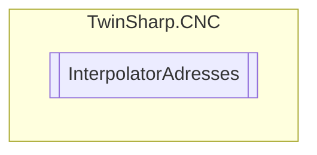

# InterpolatorAdresses `Public class`

## Diagram


## Members
### Properties
#### Public  properties
| Type | Name | Methods |
| --- | --- | --- |
| `uint` | [`BlockNumberActual`](#blocknumberactual) | `get` |
| `uint` | [`GroupIndex`](#groupindex) | `get` |

## Details
### Constructors
#### InterpolatorAdresses
[*Source code*](https://github.com///blob//TwinSharp/CNC/CncChannel.cs#L1023)
```csharp
internal InterpolatorAdresses(uint index, uint offset)
```
##### Arguments
| Type | Name | Description |
| --- | --- | --- |
| `uint` | index |   |
| `uint` | offset |   |

### Properties
#### GroupIndex
```csharp
public uint GroupIndex { get; }
```

#### BlockNumberActual
```csharp
public uint BlockNumberActual { get; }
```

*Generated with* [*ModularDoc*](https://github.com/hailstorm75/ModularDoc)
