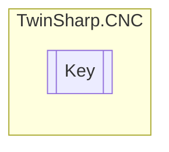

# Key `Public class`

## Diagram


## Members
### Methods
#### Public  methods
| Returns | Name |
| --- | --- |
| `void` | [`EnableControlElement`](#enablecontrolelement)(`bool` enabled) |
| `void` | [`SignalCommandSemaphor`](#signalcommandsemaphor)(`bool` signal) |
| `void` | [`WriteCommandElement`](#writecommandelement)([`HLI_HB_KEY`](./HLI_HB_KEY.md) data) |

## Details
### Constructors
#### Key
[*Source code*](https://github.com///blob//TwinSharp/CNC/ManualOperation.cs#L237)
```csharp
internal Key(AdsClient plcClient, int channelNumber, int keyIndex)
```
##### Arguments
| Type | Name | Description |
| --- | --- | --- |
| `AdsClient` | plcClient |   |
| `int` | channelNumber |   |
| `int` | keyIndex |   |

### Methods
#### EnableControlElement
[*Source code*](https://github.com///blob//TwinSharp/CNC/ManualOperation.cs#L245)
```csharp
public void EnableControlElement(bool enabled)
```
##### Arguments
| Type | Name | Description |
| --- | --- | --- |
| `bool` | enabled |   |

#### WriteCommandElement
[*Source code*](https://github.com///blob//TwinSharp/CNC/ManualOperation.cs#L252)
```csharp
public void WriteCommandElement(HLI_HB_KEY data)
```
##### Arguments
| Type | Name | Description |
| --- | --- | --- |
| [`HLI_HB_KEY`](./HLI_HB_KEY.md) | data |   |

#### SignalCommandSemaphor
[*Source code*](https://github.com///blob//TwinSharp/CNC/ManualOperation.cs#L259)
```csharp
public void SignalCommandSemaphor(bool signal)
```
##### Arguments
| Type | Name | Description |
| --- | --- | --- |
| `bool` | signal |   |

*Generated with* [*ModularDoc*](https://github.com/hailstorm75/ModularDoc)
