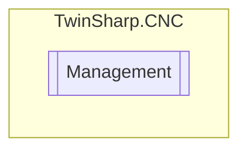

# Management `Public class`

## Diagram


## Members
### Properties
#### Public  properties
| Type | Name | Methods |
| --- | --- | --- |
| `bool` | [`PlcPresent`](#plcpresent) | `get` |

## Details
### Constructors
#### Management
[*Source code*](https://github.com///blob//TwinSharp/CNC/CncChannel.cs#L420)
```csharp
internal Management(AdsClient geoClient, Dictionary<string, ObjectDescription> descriptions)
```
##### Arguments
| Type | Name | Description |
| --- | --- | --- |
| `AdsClient` | geoClient |   |
| `Dictionary`&lt;`string`, [`ObjectDescription`](./ObjectDescription.md)&gt; | descriptions |   |

### Properties
#### PlcPresent
```csharp
public bool PlcPresent { get; }
```

*Generated with* [*ModularDoc*](https://github.com/hailstorm75/ModularDoc)
