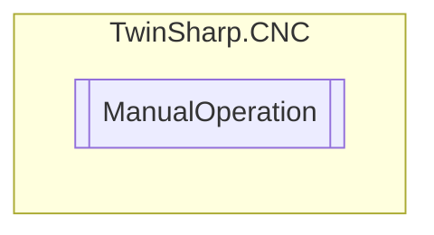

# ManualOperation `Public class`

## Diagram


## Members
### Methods
#### Public  methods
| Returns | Name |
| --- | --- |
| `void` | [`EnableControlElement`](#enablecontrolelement)(`bool` enabled) |
| `ushort` | [`GetControlElementNumber`](#getcontrolelementnumber)(`int` axisIndex)<br>Logical number of the control element currently linked to the axis in question. |
| `ushort` | [`GetManualModeState`](#getmanualmodestate)(`int` axisIndex) |
| `ushort` | [`GetOperationModeState`](#getoperationmodestate)(`int` axisIndex) |
| `int` | [`GetPathVelocityContinous`](#getpathvelocitycontinous)(`int` axisIndex)<br>Path velocity of the axis in question when moved in continuous jog mode. |
| `void` | [`SignalCommandSemaphor`](#signalcommandsemaphor)(`bool` signal) |
| `void` | [`WriteCommandElement`](#writecommandelement)([`HLI_HB_ACTIVATION`](./HLI_HB_ACTIVATION.md) controlElement) |

## Details
### Constructors
#### ManualOperation
[*Source code*](https://github.com///blob//TwinSharp/CNC/ManualOperation.cs#L18)
```csharp
public ManualOperation(AdsClient plcClient, int channelNumber)
```
##### Arguments
| Type | Name | Description |
| --- | --- | --- |
| `AdsClient` | plcClient |   |
| `int` | channelNumber |   |

### Methods
#### GetManualModeState
[*Source code*](https://github.com///blob//TwinSharp/CNC/ManualOperation.cs#L42)
```csharp
public ushort GetManualModeState(int axisIndex)
```
##### Arguments
| Type | Name | Description |
| --- | --- | --- |
| `int` | axisIndex |   |

#### GetOperationModeState
[*Source code*](https://github.com///blob//TwinSharp/CNC/ManualOperation.cs#L49)
```csharp
public ushort GetOperationModeState(int axisIndex)
```
##### Arguments
| Type | Name | Description |
| --- | --- | --- |
| `int` | axisIndex |   |

#### GetControlElementNumber
[*Source code*](https://github.com///blob//TwinSharp/CNC/ManualOperation.cs#L61)
```csharp
public ushort GetControlElementNumber(int axisIndex)
```
##### Arguments
| Type | Name | Description |
| --- | --- | --- |
| `int` | axisIndex |  |

##### Summary
Logical number of the control element currently linked to the axis in question.

##### Returns


#### GetPathVelocityContinous
[*Source code*](https://github.com///blob//TwinSharp/CNC/ManualOperation.cs#L73)
```csharp
public int GetPathVelocityContinous(int axisIndex)
```
##### Arguments
| Type | Name | Description |
| --- | --- | --- |
| `int` | axisIndex |  |

##### Summary
Path velocity of the axis in question when moved in continuous jog mode.

##### Returns


#### EnableControlElement
[*Source code*](https://github.com///blob//TwinSharp/CNC/ManualOperation.cs#L82)
```csharp
public void EnableControlElement(bool enabled)
```
##### Arguments
| Type | Name | Description |
| --- | --- | --- |
| `bool` | enabled |   |

#### WriteCommandElement
[*Source code*](https://github.com///blob//TwinSharp/CNC/ManualOperation.cs#L89)
```csharp
public void WriteCommandElement(HLI_HB_ACTIVATION controlElement)
```
##### Arguments
| Type | Name | Description |
| --- | --- | --- |
| [`HLI_HB_ACTIVATION`](./HLI_HB_ACTIVATION.md) | controlElement |   |

#### SignalCommandSemaphor
[*Source code*](https://github.com///blob//TwinSharp/CNC/ManualOperation.cs#L96)
```csharp
public void SignalCommandSemaphor(bool signal)
```
##### Arguments
| Type | Name | Description |
| --- | --- | --- |
| `bool` | signal |   |

*Generated with* [*ModularDoc*](https://github.com/hailstorm75/ModularDoc)
