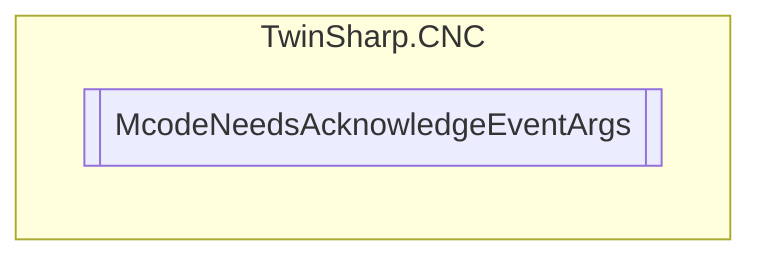

# McodeNeedsAcknowledgeEventArgs `Public class`

## Diagram


## Details
### Constructors
#### McodeNeedsAcknowledgeEventArgs
[*Source code*](https://github.com///blob//TwinSharp/CNC/TechnologyProcesses.cs#L211)
```csharp
public McodeNeedsAcknowledgeEventArgs(int indexToAck, HLI_M_H_PROZESS mhProcess)
```
##### Arguments
| Type | Name | Description |
| --- | --- | --- |
| `int` | indexToAck |   |
| [`HLI_M_H_PROZESS`](./HLI_M_H_PROZESS.md) | mhProcess |   |

*Generated with* [*ModularDoc*](https://github.com/hailstorm75/ModularDoc)
